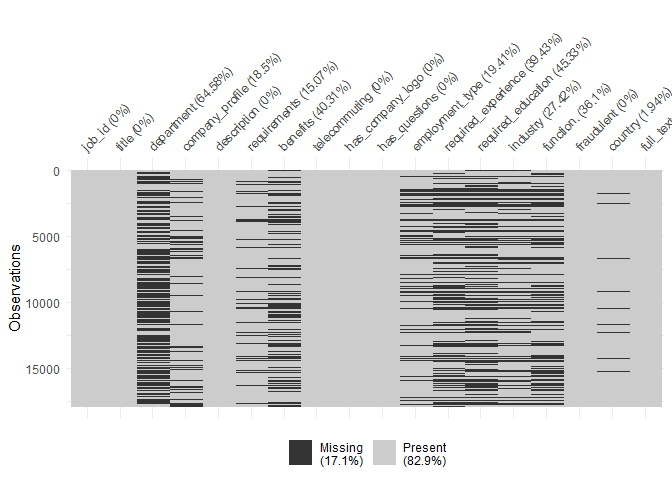

WQD7004 Group Assignment
================

# Fake Job Posting Analysis

### Group 4:

-   JingYu Shen (S2113037)
-   JiPing Zhang (S2042984)
-   Lee Mun Mun (S2112842)
-   Nayli Hatim (S2149344)
-   Jenifer Mayang Jues (S2016572)

# Introduction

# Initial Questions

-   What are the significant features of classifying fake job postings
-   Which classification model is the best to classify fake job postings

# Objectives

-   To identify key features of fraudulent job postings
-   To build a model to classify real or fake job postings

# Data Cleaning and Pre-processing

## Import libraries

## Load data

``` r
df <- read.csv("https://raw.githubusercontent.com/abbylmm/fake_job_posting/main/data/fake_job_postings.csv")
```

## Summary data

``` r
df_fake_job <- df
sample_n(df_fake_job, 3)
```

    ##   job_id                                  title              location
    ## 1  12614 Director Channel Sales - North America US, CA, San Francisco
    ## 2   2406                          Billing Clerk        US, TX, Irving
    ## 3  14857         Product Manager - Viral Growth       GB, LND, London
    ##   department salary_range
    ## 1      Sales             
    ## 2    Billing             
    ## 3    Product             
    ##                                                                                                                                                                                                                                                                                                                                                                                                                                                                                                                                                                                                                                                                                                                                                                                                                                                                                                                                                                                                                                                                                                                                                                                                                                                                                                                                                                                                                                                                                                                                                                                                                                                                                                                                                                       company_profile
    ## 1 Vend is looking for some awesome new talent to come join us. You'll be working in an awesome team doing awesome things, and generally being awesome.Learn about us on our blog, or meet the team on Twitter, Facebook, LinkedInAwesome SpaceOur brand new Auckland office space is located on Nuffield Street in Newmarket, surrounded by our customers and the industry we love. It is huge, open, and shiny new with great meeting room spaces, casual working environments and plenty of space to host awesome events. We don't do cubicles, just plenty of space, whiteboards and meetings rooms. We also have a great cafe/retail space with our very own Front of House Manager taking care of our visitors and fellow Venders. Like Auckland our Melbourne office is surrounded by retail. It's a great wee space equipped with tiny houses and some awesome cardboard cutout animals.Our Toronto office is located right in the heart of downtown retail district. Like Melbourne and Auckland there's a great vibe with great coffee, boutique stores and some of the greatest restaurants in the city. Our SoMa office in San Francisco is located in the middle of the SF tech scene, just a (Biz) stone's throw from Twitter.The EnvironmentWe want you to be at the top of your game. You can wear whatever clothing you like, start work late in the morning, take breaks whenever you want and generally work the way you want to work. Who we're looking forVend is looking for people to push the boundaries. We are a hard working professional team with a wicked sense of humour, and we are looking for people who thrive in a collaborative open environment. We want passionate, hard working, talented individuals that want to lead in their field.
    ## 2                                                                                                                                                                                                                                                                                                                                                                                                                                                                                                                                                                                                                                                                                                                                                                                                                                                                                                                                                                                                                                                                                                                       The best word to describe PCPâ\200\231s culture is PRIDE. Pride in our company. Pride in our job. And pride in our relationships.That pride contributes to the fact that employees at PCP are happy and like working for PCP. Furthermore, PCPâ\200\231s employees are our number-one asset.If you are an exceptional, motivated individual with a desire for an opportunity to grow, be challenged, and make a difference, we invite you to take a close look at what PCP has to offer. We also invite you to share with PCP what you have to offer.Interested in any of our current job openings? Please be sure to fill out an application by clicking the job title.
    ## 3                                                                                                                                                                                                                                                                                                                                                                                                                                                                                                                                                                                                                                                                                                                                                                                                                                                                                                                                                                                                                                                                                                                                                                                                                                                                                                                                                                                                                                                             Want to build a 21st century financial service?We're convinced that that there is a need for innovation in financial services and that current banks will not be the ones providing this. Instead this innovation will come from companies like TransferWise and we're on a hunt for great minds who think like we do.
    ##                                                                                                                                                                                                                                                                                                                                                                                                                                                                                                                                                                                                                                                                                                                                                                                                                                                                                                                                                                                                                                                                                                                                                                                                                                                        description
    ## 1                                    Just in case this is the first time youâ\200\231ve visited our website Vend is an award winning web based point of sale software for retail.  Weâ\200\231re chucking out crusty old cash registers and replacing them with iPads, touch screens and beautiful software, all of this to make life easier for our retailers.  Vend is a fast-growing tech start-up, since launching in 2010 weâ\200\231ve now got 10,000+ customers and 650 partners all over the world with more than 120 employees shared between our Auckland, Melbourne, Toronto, Berlin, London &amp; San Francisco offices.If youâ\200\231re familiar with our (and a lot of other SaaS companies) business model youâ\200\231ll know and understand the importance of a strong partner channel to complement direct sales. Weâ\200\231re looking for someone who can take this huge opportunity to drive a vast channel network in North America and develop strong and strategic partnerships with Vend advisors &amp; experts throughout the territory.Not only will you be managing those important external relationships youâ\200\231ll also need to ensure you have close ties with other Vend teams in ensuring that weâ\200\231re able to deliver the things we need to delight our customers.
    ## 2 Professional Civil Process (PCP) is looking for a Billing Clerk â\200“ a person who wants to go above and beyond for the legal support industry. Weâ\200\231re looking for someone with exceptional energy and enthusiasm to join our Dallas Team. We will conduct interviews the week of June 30, 2014 and fill the postion by July 9, 2014.About PCP:PCP is the leader in the legal support industry providing filing, serving, and skip tracing services.Weâ\200\231ve been serving the legal community for over thirty-five years.PCP currently handles over 140,000 services of process documents annually.Our corporate headquarters is in Spicewood, Texas with 19 offices throughout the state of Texas.PCP is a founding member of the National Association of Professional Process Servers (NAPPS) and the Texas Process Servers Association (TPSA).About the position:Responds to email and voicemail in a timely mannerReviews affidavits to ensure its accuracy and completenessLearn and become familiar with our billing codesKey in billing codes for services renderedGenerate, review, and mail out billing statementsAnswer incoming calls or emails from clients concerning an invoice or statementReviews skip trace reportsWorks daily exception reports
    ## 3                                                                                                                                                                                                                                                                                                                                                                                                                                                   Co-founded by Skypeâ\200\231s first employee and backed by some of the planet's most experienced innovators, including Sir Richard Branson &amp; Facebook's first investor Peter Thiel, we're disrupting the world of currency &amp; international money transfer. That means flipping a gazillion dollar industry on its head and taking power away from banks and the establishment.Located in the heart of Old Street, weâ\200\231re right at the hub of Londonâ\200\231s startup scene, weâ\200\231re growing at an extraordinary rate and looking for exceptional talent to jump on board.Weâ\200\231re currently 200 people strong and handling many millions of pounds daily.If youâ\200\231re looking for a stuffy financial company, the back button beckons, if you want to be part of something innovative and truly exciting, read on.
    ##                                                                                                                                                                                                                                                                                                                                                                                                                                                                                                                                                                                                                                                                                                                                                                                                                                                                                                                                                                                                                                                                                                                                                                                                                                                                                                                                                                                                                                                                                                                                                                                                                                                                                                                                                                                                                                                                                                                                                                                                                                                                                                                                                                                                                                                                                                                                                                                                                                                                                                                                                                                                                                                                                                                                                                                                                                                                                                                                                                                                                                                                                                                                                                                                                                                                                                   requirements
    ## 1                                                                                                                                                                                                                                                                                                                                                                                                                                                                                                                                                                                                                                                                                                                                                                                                                                                                                                                                                                                                                                                                                                                                                                                                                                                                                                                                                                                                                                                                                                                                                                                                                                                                                                                                                                                                                                                                                                                                                                                                                                             To ace this role you:Are strategic and already have strong relationships in the retail and/or technology industries in North AmericaWill have successfully developed and managed strong channel networks. This includes the recruitment, enablement and ongoing success of these channel networks.Will be motivated by the success of our channel partners and how that delights our customers and exceeds their expectationsBuild great relationships within all areas of a business with communication being a priority and core component towards ensuring weâ\200\231re delivering for our customers and looking after one another internallyKnow your way around the tech scene in North America and know where there may be opportunities for technology companies to join our successful ecosystemBe able to coach and train members of the Channel team across North AmericaOptimise processes around Channel Management and provide input into Value Propositions &amp; GoToMarket strategies across North AmericaWork alongside our Channel Marketing teamWill have the ability to put people first while still getting the best outcomes for our customers and Vend alikeProvide monthly reporting of relevant channel metrics to the Chief Revenue Officer
    ## 2                                                                                                                                                                                                                                                                                                                                                                                                                                                                                                                                                                                                                                                                                                                                                                                                                                                                                                                                                                                                                                                                                                                                                                                                                                                                                                                                                                                                                                                                                                                                                                                                                                                                                                                                                                                                                                                                                                                                                                                                                                                                                                                                                                                                                                                                                                                                                                                                                                                                                                                                                                                                                                                                                                                                                                                                                                                                                                                                                                                 About you:High school diploma or equivalent2-4 years of billing experienceAble to understand and follow instructionsDetailed oriented and organizedMulti-tasking skillsPunctuality and reliabilityCommitment to team results; a team playerExcellent oral and written communication skillsTyping skills: 35 words per minute
    ## 3 We're looking for a rockstar viral product manager to lead our virality team.We believe that growth comes from delivering an incredible experience to our customers.  Our customers market us best - and we actively invest in delighting them and encouraging them to advocate our product and services.  This drives growth directly through â\200œword of mouthâ\200\235 marketing and our industry leading "refer a friend" program.  We are looking for a product manager that would lead our virality team: responsible for growing our customer base through â\200œword of mouthâ\200\235 and referral marketing.Within the team youâ\200\231ll be completely empowered to deliver a step change in our viral growth rates:Youâ\200\231ll have control of our invite (referral) program (i.e. invite 3 friends to TransferWise and earn £10)Youâ\200\231ll be empowered to iterate and test monetary and non-monetary incentivesYouâ\200\231ll launch tests on our landing pages, emails and within our productAs we scale internationally you will be responsible for programs to localise our virality programs for local customsYou will own and be empowered to develop the emails we send our customers to encourage them to refer their friends to TransferWiseYouâ\200\231ll have a team of developers and access to a data scientist + support of VP Growth and the wider team in the roleMust Haves:Delivery experienceA proven track record of product management experienceYou have strong hands-on experience in working with developers.  You understand scrum, agile, can structure a backlog and can run stand upsYou understand how to work with developers collaboratively as a product managerYou can effectively prioritise features, understand what a true  MVP looks like and strategies for managing technical debtYou are able to develop simple wireframes that align with product objectivesYou arenâ\200\231t afraid to get your hands dirty and test your product thoroughly and interview customers where appropriateTechnical experienceYou have an understanding of the web works, i.e, knowledge of HTML, CSS, tracking (cookies and link tracking), javascript (esp #URL_5543aa46fe37875fcc9e8b278ee02d4a18479d6d208cad289401987349eea211#) and the mobile internetAnalytical capabilityYou live and breath A/B tests, cohort analysis and understand the quantitative side of product developmentYou understand the nuances of statistical significance and can structure tests that help you learn quicklyYou understand when to test and when to just shipCreativity and empathy for our customers  You also have an appreciation that creativity and empathy is something that cannot be measured and have intuitive understanding of customers motivations behind the dataYou have a proven ability to delight customers - and know how to create intuitive interfacesMarketing experience (nice to have) Have some experience in marketing (ideally email marketing) - and understand how to sell with copy and imageryAn understanding of the metrics of email marketing, open rates, click through rates, conversion ratesIdeally you have some experience of building a product with viral growth.  Words like viral co-efficient, viral loops, 2 sided invites are a strategy you understand and employ
    ##                                                                                                                                                                                                                                                                                                                                                                                                                                                                                                                                                                                                                                                                                                                                                                                                                                                                                                       benefits
    ## 1 What can you expect from us?We have an open culture where we openly share our results and where your input is truly valued.We'll have a great environment for you to work in and grow the team.We work hard but we also have a lot of fun at work!Work-life balance or "blend" as we like to call it.  We know you have a life outside of work and at Vend you can have a life inside work too.Utilise all your talents.  Not just the ones written in your job description.We welcome all of you at work.  We donâ\200\231t want you to leave your personality at the door.If youâ\200\231re interested in joining one of NZâ\200\231s (and the world's, IMHO) most exciting companies, Best Workplaces and obviously the most fun and hard working environments around weâ\200\231d love to hear from you.Get in touch, apply now, hit that button, get it done and come have a chat with us. We canâ\200\231t wait to hear from you!
    ## 2                                                                                                                                                                                                                                                                                                                                                                                                                                                                                                                                                                                                                                            Compensation, Hours, and Benefits:90-day trial periodFull Time: Monday â\200“ Friday,  8:00a - 5:00pPay: $11.00 per hourDental/Vision planNine (9) paid holidays per calendar yearPaid Time Off (PTO)401K savings plan with company matchingCasual work environment
    ## 3                                                                                                                                                                                                                                                                                                                                                                                                    Apart from all-expenses-paid company holidays twice a year (which are completely insane)  stock options in one of Europeâ\200\231s most hotly tipped startups, a sexy laptop of your choice and team lunches every Friday, you wonâ\200\231t get much in the way of extras. However, we will give you 25 days holiday a year (plus public holidays), a fun, friendly atmosphere, plenty of opportunities to grow and the chance to be part of our little revolution. Oh, and coffee, thereâ\200\231s plenty of coffee.#LDN
    ##   telecommuting has_company_logo has_questions employment_type
    ## 1             0                1             1       Full-time
    ## 2             0                1             1       Full-time
    ## 3             0                1             0                
    ##   required_experience        required_education          industry function.
    ## 1            Director                           Computer Software     Sales
    ## 2         Entry level High School or equivalent    Legal Services          
    ## 3                                                                          
    ##   fraudulent
    ## 1          0
    ## 2          0
    ## 3          0

``` r
summary(df_fake_job)
```

    ##      job_id         title             location          department       
    ##  Min.   :    1   Length:17880       Length:17880       Length:17880      
    ##  1st Qu.: 4471   Class :character   Class :character   Class :character  
    ##  Median : 8940   Mode  :character   Mode  :character   Mode  :character  
    ##  Mean   : 8940                                                           
    ##  3rd Qu.:13410                                                           
    ##  Max.   :17880                                                           
    ##  salary_range       company_profile    description        requirements      
    ##  Length:17880       Length:17880       Length:17880       Length:17880      
    ##  Class :character   Class :character   Class :character   Class :character  
    ##  Mode  :character   Mode  :character   Mode  :character   Mode  :character  
    ##                                                                             
    ##                                                                             
    ##                                                                             
    ##    benefits         telecommuting    has_company_logo has_questions   
    ##  Length:17880       Min.   :0.0000   Min.   :0.0000   Min.   :0.0000  
    ##  Class :character   1st Qu.:0.0000   1st Qu.:1.0000   1st Qu.:0.0000  
    ##  Mode  :character   Median :0.0000   Median :1.0000   Median :0.0000  
    ##                     Mean   :0.0429   Mean   :0.7953   Mean   :0.4917  
    ##                     3rd Qu.:0.0000   3rd Qu.:1.0000   3rd Qu.:1.0000  
    ##                     Max.   :1.0000   Max.   :1.0000   Max.   :1.0000  
    ##  employment_type    required_experience required_education   industry        
    ##  Length:17880       Length:17880        Length:17880       Length:17880      
    ##  Class :character   Class :character    Class :character   Class :character  
    ##  Mode  :character   Mode  :character    Mode  :character   Mode  :character  
    ##                                                                              
    ##                                                                              
    ##                                                                              
    ##   function.           fraudulent     
    ##  Length:17880       Min.   :0.00000  
    ##  Class :character   1st Qu.:0.00000  
    ##  Mode  :character   Median :0.00000  
    ##                     Mean   :0.04843  
    ##                     3rd Qu.:0.00000  
    ##                     Max.   :1.00000

## Check all the missing values - ‘empty’

``` r
skim(df_fake_job)
```

|                                                  |             |
|:-------------------------------------------------|:------------|
| Name                                             | df_fake_job |
| Number of rows                                   | 17880       |
| Number of columns                                | 18          |
| \_\_\_\_\_\_\_\_\_\_\_\_\_\_\_\_\_\_\_\_\_\_\_   |             |
| Column type frequency:                           |             |
| character                                        | 13          |
| numeric                                          | 5           |
| \_\_\_\_\_\_\_\_\_\_\_\_\_\_\_\_\_\_\_\_\_\_\_\_ |             |
| Group variables                                  | None        |

Data summary

**Variable type: character**

| skim_variable       | n_missing | complete_rate | min |   max | empty | n_unique | whitespace |
|:--------------------|----------:|--------------:|----:|------:|------:|---------:|-----------:|
| title               |         0 |             1 |   3 |   142 |     0 |    11231 |          0 |
| location            |         0 |             1 |   0 |   161 |   346 |     3106 |          0 |
| department          |         0 |             1 |   0 |   255 | 11547 |     1338 |          6 |
| salary_range        |         0 |             1 |   0 |    20 | 15012 |      875 |          0 |
| company_profile     |         0 |             1 |   0 |  6230 |  3308 |     1710 |          0 |
| description         |         0 |             1 |   3 | 22722 |     0 |    14802 |          0 |
| requirements        |         0 |             1 |   0 | 10921 |  2694 |    11970 |          0 |
| benefits            |         2 |             1 |   0 |  4489 |  7206 |     6207 |          0 |
| employment_type     |         0 |             1 |   0 |     9 |  3471 |        6 |          0 |
| required_experience |         0 |             1 |   0 |    16 |  7050 |        8 |          0 |
| required_education  |         0 |             1 |   0 |    33 |  8105 |       14 |          0 |
| industry            |         0 |             1 |   0 |    36 |  4903 |      132 |          0 |
| function.           |         0 |             1 |   0 |    22 |  6455 |       38 |          0 |

**Variable type: numeric**

| skim_variable    | n_missing | complete_rate |    mean |      sd |  p0 |     p25 |    p50 |      p75 |  p100 | hist  |
|:-----------------|----------:|--------------:|--------:|--------:|----:|--------:|-------:|---------:|------:|:------|
| job_id           |         0 |             1 | 8940.50 | 5161.66 |   1 | 4470.75 | 8940.5 | 13410.25 | 17880 | ▇▇▇▇▇ |
| telecommuting    |         0 |             1 |    0.04 |    0.20 |   0 |    0.00 |    0.0 |     0.00 |     1 | ▇▁▁▁▁ |
| has_company_logo |         0 |             1 |    0.80 |    0.40 |   0 |    1.00 |    1.0 |     1.00 |     1 | ▂▁▁▁▇ |
| has_questions    |         0 |             1 |    0.49 |    0.50 |   0 |    0.00 |    0.0 |     1.00 |     1 | ▇▁▁▁▇ |
| fraudulent       |         0 |             1 |    0.05 |    0.21 |   0 |    0.00 |    0.0 |     0.00 |     1 | ▇▁▁▁▁ |

## Split location to country, state, city and fill empty with NA

``` r
df_fake_job[c("country", "state", "city")] <- str_split_fixed(df_fake_job$location, ", ", 3)
df_fake_job[c("country", "state", "city")][df_fake_job[c("country", "state", "city")] == ""] <- NA
```

## Split salary_range to min_salary, max_salary and fill empty with NA

``` r
df_fake_job[c("min_salary", "max_salary")] <- str_split_fixed(df_fake_job$salary_range, "-", 2)
df_fake_job[c("min_salary", "max_salary")][df_fake_job[c("min_salary", "max_salary")] == ""] <- NA
```

## Drop location and salary_range

``` r
df_fake_job <- select(df_fake_job, -c(location, salary_range))
```

## View the structure of data

``` r
glimpse(df_fake_job)
```

    ## Rows: 17,880
    ## Columns: 21
    ## $ job_id              <int> 1, 2, 3, 4, 5, 6, 7, 8, 9, 10, 11, 12, 13, 14, 15,~
    ## $ title               <chr> "Marketing Intern", "Customer Service - Cloud Vide~
    ## $ department          <chr> "Marketing", "Success", "", "Sales", "", "", "ANDR~
    ## $ company_profile     <chr> "We're Food52, and we've created a groundbreaking ~
    ## $ description         <chr> "Food52, a fast-growing, James Beard Award-winning~
    ## $ requirements        <chr> "Experience with content management systems a majo~
    ## $ benefits            <chr> "", "What you will get from usThrough being part o~
    ## $ telecommuting       <int> 0, 0, 0, 0, 0, 0, 0, 0, 0, 0, 0, 0, 0, 0, 0, 0, 0,~
    ## $ has_company_logo    <int> 1, 1, 1, 1, 1, 0, 1, 1, 1, 1, 0, 1, 1, 1, 1, 1, 1,~
    ## $ has_questions       <int> 0, 0, 0, 0, 1, 0, 1, 1, 1, 0, 0, 0, 0, 1, 0, 1, 0,~
    ## $ employment_type     <chr> "Other", "Full-time", "", "Full-time", "Full-time"~
    ## $ required_experience <chr> "Internship", "Not Applicable", "", "Mid-Senior le~
    ## $ required_education  <chr> "", "", "", "Bachelor's Degree", "Bachelor's Degre~
    ## $ industry            <chr> "", "Marketing and Advertising", "", "Computer Sof~
    ## $ function.           <chr> "Marketing", "Customer Service", "", "Sales", "Hea~
    ## $ fraudulent          <int> 0, 0, 0, 0, 0, 0, 0, 0, 0, 0, 0, 0, 0, 0, 0, 0, 0,~
    ## $ country             <chr> "US", "NZ", "US", "US", "US", "US", "DE", "US", "U~
    ## $ state               <chr> "NY", NA, "IA", "DC", "FL", "MD", "BE", "CA", "FL"~
    ## $ city                <chr> "New York", "Auckland", "Wever", "Washington", "Fo~
    ## $ min_salary          <chr> NA, NA, NA, NA, NA, NA, "20000", NA, NA, NA, "1000~
    ## $ max_salary          <chr> NA, NA, NA, NA, NA, NA, "28000", NA, NA, NA, "1200~

``` r
class(df_fake_job)
```

    ## [1] "data.frame"

## View column names

``` r
names(df_fake_job)
```

    ##  [1] "job_id"              "title"               "department"         
    ##  [4] "company_profile"     "description"         "requirements"       
    ##  [7] "benefits"            "telecommuting"       "has_company_logo"   
    ## [10] "has_questions"       "employment_type"     "required_experience"
    ## [13] "required_education"  "industry"            "function."          
    ## [16] "fraudulent"          "country"             "state"              
    ## [19] "city"                "min_salary"          "max_salary"

## Check if any duplication id

``` r
table(duplicated(df_fake_job$job_id))
```

    ## 
    ## FALSE 
    ## 17880

``` r
### there is no duplication id
```

## Check for total missing values for each feature

``` r
colSums(is.na(df_fake_job))
```

    ##              job_id               title          department     company_profile 
    ##                   0                   0                   0                   0 
    ##         description        requirements            benefits       telecommuting 
    ##                   0                   0                   2                   0 
    ##    has_company_logo       has_questions     employment_type required_experience 
    ##                   0                   0                   0                   0 
    ##  required_education            industry           function.          fraudulent 
    ##                   0                   0                   0                   0 
    ##             country               state                city          min_salary 
    ##                 346                2580                2067               15012 
    ##          max_salary 
    ##               15013

``` r
### there are two missing values in 'benefits' column
```

## Populate missing rates for each feature

``` r
colSums(is.na(df_fake_job)/length(df_fake_job)*100)
```

    ##              job_id               title          department     company_profile 
    ##             0.00000             0.00000             0.00000             0.00000 
    ##         description        requirements            benefits       telecommuting 
    ##             0.00000             0.00000             9.52381             0.00000 
    ##    has_company_logo       has_questions     employment_type required_experience 
    ##             0.00000             0.00000             0.00000             0.00000 
    ##  required_education            industry           function.          fraudulent 
    ##             0.00000             0.00000             0.00000             0.00000 
    ##             country               state                city          min_salary 
    ##          1647.61905         12285.71429          9842.85714         71485.71429 
    ##          max_salary 
    ##         71490.47619

## List rows with missing values

``` r
missingdf <- df_fake_job[!complete.cases(df_fake_job), ]
```

## Visualize missing values

``` r
gg_miss_var(df_fake_job, show_pct = TRUE) + labs(y = "% Missing")
```

    ## Warning: It is deprecated to specify `guide = FALSE` to remove a guide. Please
    ## use `guide = "none"` instead.

<!-- -->

## Merge columns and create a new ‘full_text’ column

``` r
viz_df <- select(df_fake_job, -c(max_salary, min_salary, state, city))
viz_df$full_text <- 
  paste(na.omit(viz_df$title), 
        na.omit(viz_df$country), 
        na.omit(viz_df$department), 
        na.omit(viz_df$company_profile), 
        na.omit(viz_df$description), 
        na.omit(viz_df$requirements), 
        na.omit(viz_df$benefits), 
        na.omit(viz_df$employment_type), 
        na.omit(viz_df$required_experience), 
        na.omit(viz_df$required_education), 
        na.omit(viz_df$industry), 
        na.omit(viz_df$function.))
viz_df[viz_df == ""] <- NA
# sample(viz_df, 3)
# write.csv(viz_df, "C:/Users/munmu/Documents/GitHub/fake_job_posting\\viz_df.csv", row.names = FALSE)
```

## Visualize missing profile for each feature

``` r
plot_missing(viz_df)
```

<!-- -->

## Drop columns

``` r
model_df <- select(viz_df, 
                   -c(title, 
                      country, 
                      department, 
                      company_profile, 
                      description, 
                      requirements, 
                      benefits, 
                      employment_type, 
                      required_experience, 
                      required_education, 
                      industry, 
                      function.))
sample_n(model_df, 3)
```

    ##   job_id telecommuting has_company_logo has_questions fraudulent
    ## 1   4855             0                1             1          0
    ## 2   6205             0                1             1          0
    ## 3   2087             0                1             0          0
    ##                                                                                                                                                                                                                                                                                                                                                                                                                                                                                                                                                                                                                                                                                                                                                                                                                                                                                                                                                                                                                                                                                                                                                                                                                                                                                                                                                                                                                                                                                                                                                                                                                                                                                                                                                                                                                                                                                                                                                                                                                                                                                                                                                                                                                                                                                                                                                                                                                                                                                                                                                                                                                                                                                                                                                                                                                                                                                                                                                      full_text
    ## 1 Marketing Content Specialist US  VeriPic is a leading supplier of enterprise photo and evidence management software to Law Enforcement Agencies, Military, Medical Institutions and Corporate customers. Our products set the bar on how digital evidence is handled. Every year, our products handle evidence in thousands of criminal cases throughout the country. VeriPic builds systems from single user systems up to multi-city, server cluster installations serving an entire agency with locations that are geographically distributed. VeriPic was also honored in October 2010 with the Cygnus Law Enforcement Group's Innovation Award's at the 2010 International Association of Chiefs of Police conference as the best Law Enforcement Software product across all categories of software products. Visit #URL_edfc715b7ae02f67902345d98b253fe06d2f3f73e7d5955e6b9cf0fcf12841aa# to see what we do. Visit VeriPic Youtube ChannelVisit #URL_52c30d8ba6deffcf77d6260406f818ee8fbd37379f60f56baf55b780ce859119#-#URL_08c993e8fdb735ddbba072a268b911588edf5256edf497ac1faa5a98e7551ae6# to get a copy of a car accident report. Like us on at #URL_7069c91c3f60479f7cbe42d2f1688c62638969f23b6d1ecce39227c2e3033fc6# or follow us on Twitter #VeriPic Marketing Content SpecialistThe Marketing Content Specialist is a dynamic, self-motivated individual with strong communication skills and experience in content creation. The successful candidate will work in a growing business environment to help promote a suite of software products and services engineered to serve law enforcement.Responsibilities:Copy writingMarket and product researchWork across all departments to help create marketing and sales content  Job Requirements:BA/BS degree in Marketing, Journalism or related fieldStrong communication skills, both verbal and writtenUnderstanding of or experience with the law enforcement marketDesirable Skills:Knowledge of technical language and productsUnderstanding of law enforcement terminology  Job BenefitsStandard Benefits: This position pays a competitive salary. We offer paid vacations, dental, medical and prescription drug coverage.VeriPician Benefits: We like to have fun at work, too. We dress casually because we believe that you should be comfortable at work. In addition, we have company social events, such as comedy nights, new product release parties, company picnics and more! We believe that a company is only as happy as its employees and we make every effort to ensure that our employees feel valued.This position is based out of our corporate headquarters in the heart of Silicon Valleyâ\200”Santa Clara, CA. If you are looking for a change of scenery, Santa Clara is only one hour from the beach and four hours from the ski slopes, with great weather year round!  Full-time Mid-Senior level Bachelor's Degree Law Enforcement Marketing
    ## 2                                                                                                                                                                                                                                                                                                                                                                                                                                                                                                                                                                                                                                                                                                                                                                                                                                                                                                                                                                                                                                                                                                                                                                                                                                                                                                                                                                         Lead Designer US  Highlight is a fun, simple way to learn more about the people around you.If someone standing near you also has Highlight, their profile will show up on your phone. You can see their name, photos of them, mutual friends, and anything else they have chosen to share. When you meet someone, Highlight helps you see what you have in common with them. And when you forget their name at a party a week later, Highlight can help you remember it.As you go about your day, Highlight runs quietly in the background, surfacing information about the people around you. If your friends are nearby, it will notify you. If someone interesting crosses your path, it will tell you more about them.Highlight gives you a sixth sense about the world around you, showing you hidden connections and making your day more fun. Highlight is looking for a talented Lead Designer join its fast growing team. Strong portfolio of past projects that you can share with usAbility to create breathtaking, pixel-perfect designs and iconsObsession with crafting simple, intuitive, and delightful user experiencesFluency with Photoshop that allows you to rapidly prototype new ideas and communicate them to the teamDeep curiosity about the underlying emotions and experiences that drive social productsDesire to set new standards for app designBonus points for:BS in Computer Science, HCI, or equivalent, with ability to implement your own designsExperience designing iOS/Android applications  Full-time Mid-Senior level Unspecified  Design
    ## 3                                                                                                                                                                                                                                                                                                                                                                                                                                                                                                                                                                                                                                                                                                                                                                                                                                                                                                                                                                                                                                                                                                                                                                                                                                                                                                                                                                                                                                                                                                                                                                                                                                        WEB DEVELOPER US Information Technology Zylun is expanding the recruiting landscape for companies worldwide. We help businesses better compete and increase profits by connecting them with top global talent.Our unique co-sourcing model gives you greater reliability but also puts you in the driver seat allowing you to select your team and work directly with them. We provide enterprise level recruiting, infrastructure, HR supervision and IT support so clients can focus their time on the important work. Requirements:Experience implementing on-site changes through Drupal and other CMS platformsExperience with domain-level site modifications (HTACCESS, 301 redirects, database queries, etc.)Ability to leverage current CMS data to build out new templates/pages Nice to have:Familiarity with CMS platforms and how they work (Such as Magento, Wordpress, Shopify, Shopatron, etc., or anything .NET based)Familiarity with contemporary SEOExperience working with several sites simultaneously, aggressive time/task mgt.Experience with API implementations (weâ\200\231re using several different tools at the moment) in-depth Excel experience, to help with analysis &amp; dashboard design if/when necessary  Full-time  Master's Degree Staffing and Recruiting Information Technology

``` r
# write.csv(model_df, "C:/Users/munmu/Documents/GitHub/fake_job_posting\\model_df.csv", row.names = FALSE)
```

## Check NA or missing values

``` r
sum(is.na(model_df))
```

    ## [1] 0

``` r
sum(model_df == "")
```

    ## [1] 0

## Visualize missing values

``` r
vis_miss(model_df)
```

    ## Warning: `gather_()` was deprecated in tidyr 1.2.0.
    ## Please use `gather()` instead.
    ## This warning is displayed once every 8 hours.
    ## Call `lifecycle::last_lifecycle_warnings()` to see where this warning was generated.

<!-- -->

``` r
vis_dat(model_df)
```

<!-- -->

# Exploratory Data Analysis (EDA)

## Visualize fraud and real

``` r
viz_df$fraudulent[viz_df$fraudulent == 1] <- "Yes"
viz_df$fraudulent[viz_df$fraudulent == 0] <- "No"
count <- table(viz_df$fraudulent)
barplot(count, 
        main="Real and Fraudulent", 
        xlab="fraudulent", 
        ylab="count", 
        col="#69b3a2"
)
```

<!-- -->

## Visualize country-wise job postings

``` r
temp <- na.omit(subset(viz_df, select = c(country, job_id))) %>% 
  group_by(country) %>% 
  summarize(n = n()) %>% 
  arrange(desc(n)) %>% 
  slice(1:10)

barplot(height=temp$n, 
        main="Top 10 Country-wise Job Postings", 
        ylab="count", 
        col=brewer.pal(10, "Set3"), 
        names.arg=c("United States",
                    "United Kingdom",
                    "Greece",
                    "Canada",
                    "Germany",
                    "New Zealand",
                    "India",
                    "Australia",
                    "Philippines",
                    "Netherlands"), 
        cex.names=0.6, 
        las=2
)
```

<!-- -->

## Visualize the required experiences in the jobs

``` r
temp <- na.omit(subset(viz_df, select = c(required_experience, job_id))) %>% 
  group_by(required_experience) %>% 
  summarize(n = n()) %>% 
  arrange(desc(n))

barplot(height=temp$n, 
        names=temp$required_experience, 
        main="No. of Job Postings with different required experiences", 
        ylab="count", 
        col=brewer.pal(7, "Set2"), 
        cex.names=0.6, 
        las=2
)
```

<!-- -->

## Visualize job postings with company logo

``` r
viz_df$has_company_logo[viz_df$has_company_logo == 1] <- "Yes"
viz_df$has_company_logo[viz_df$has_company_logo == 0] <- "No"

df1 <- na.omit(subset(viz_df, select = c(employment_type, has_company_logo))) %>% 
  group_by(employment_type, has_company_logo) %>% 
  summarize(yes = n(), .groups = 'drop') %>% 
  filter(has_company_logo=="Yes")
df1 <- subset(df1, select = c(employment_type, yes))
df2 <- na.omit(subset(viz_df, select = c(employment_type, has_company_logo))) %>% 
  group_by(employment_type, has_company_logo) %>% 
  summarize(no = n(), .groups = 'drop') %>% 
  filter(has_company_logo=="No")
df2 <- subset(df2, select = c(no))
df_new <- cbind(df1, df2)

fig <- df_new %>% plot_ly()
fig <- fig %>% add_trace(x = ~employment_type, y = ~no, type = 'bar', 
             text = ~no, textposition = 'auto', name = 'No', 
             marker = list(color = 'rgb(158,202,225)', 
                           line = list(color = 'rgb(8,48,107)', width = 1.5)))
fig <- fig %>% add_trace(x = ~employment_type, y = ~yes, type = 'bar', 
            text = ~yes, textposition = 'auto', name = 'Yes', 
            marker = list(color = 'rgb(58,200,225)', 
                          line = list(color = 'rgb(8,48,107)', width = 1.5)))
fig <- fig %>% layout(title = "Job Postings with Company Logo based on Employment Type",
         barmode = 'group',
         xaxis = list(title = "employment_type"),
         yaxis = list(title = "count"))
fig
```

<!-- -->

## Visualize job postings with questions

``` r
viz_df$has_questions[viz_df$has_questions == 1] <- "Yes"
viz_df$has_questions[viz_df$has_questions == 0] <- "No"

df1 <- na.omit(subset(viz_df, select = c(employment_type, has_questions))) %>% 
  group_by(employment_type, has_questions) %>% 
  summarize(yes = n(), .groups = 'drop') %>% 
  filter(has_questions=="Yes")
df1 <- subset(df1, select = c(employment_type, yes))
df2 <- na.omit(subset(viz_df, select = c(employment_type, has_questions))) %>% 
  group_by(employment_type, has_questions) %>% 
  summarize(no = n(), .groups = 'drop') %>% 
  filter(has_questions=="No")
df2 <- subset(df2, select = c(no))
df_new <- cbind(df1, df2)

fig <- df_new %>% plot_ly()
fig <- fig %>% add_trace(x = ~employment_type, y = ~no, type = 'bar', 
             text = ~no, textposition = 'auto', name = 'No', 
             marker = list(color = 'rgb(158,202,225)', 
                           line = list(color = 'rgb(8,48,107)', width = 1.5)))
fig <- fig %>% add_trace(x = ~employment_type, y = ~yes, type = 'bar', 
            text = ~yes, textposition = 'auto', name = 'Yes', 
            marker = list(color = 'rgb(58,200,225)', 
                          line = list(color = 'rgb(8,48,107)', width = 1.5)))
fig <- fig %>% layout(title = "Job Postings with Questions based on Employment Type",
         barmode = 'group',
         xaxis = list(title = "employment_type"),
         yaxis = list(title = "count"))
fig
```

<!-- -->

## Visualize the job function with fraudulent job postings

``` r
temp <- na.omit(subset(viz_df, select = c(function., fraudulent))) %>% 
  group_by(function., fraudulent) %>% 
  summarize(n = n(), .groups = 'drop') %>% 
  group_by(function.) %>% 
  summarize(pct_fraud = round(sum(n[fraudulent=="Yes"]/sum(n)), digits=2), 
            pct_good = 1-pct_fraud, .groups = 'drop') %>% 
  arrange(desc(pct_fraud)) %>% 
  slice(1:10)

melted_temp <- melt(temp, id = "function.")

ggplot(melted_temp, aes(x = function., y = value, fill = variable)) + 
  geom_bar(position = "fill", 
           stat = "identity", 
           color = "black", 
           width = 0.8) + 
  theme(axis.text.x = element_text(angle = 90, hjust = 1, vjust = 0.6)) + 
  scale_y_continuous(labels = scales::percent) + 
  geom_text(aes(label = paste0(value*100,"%")), 
            position = position_stack(vjust = 0.6), size = 2) + 
  ggtitle("Job Function with Fraudulent Job Postings (in %)") + 
  xlab("function") + 
  ylab("percentage")
```

<!-- -->

# Modeling

## Classification

## Regression

# Data Prediction

# Evaluation
