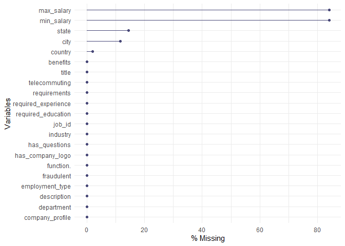

WQD7004 Group Assignment
================

# Fake Job Posting Analysis

### Group 4:

-   JingYu Shen (S2113037)
-   JiPing Zhang (S2042984)
-   Lee Mun Mun (S2112842)
-   Nayli Hatim (S2149344)
-   Jenifer Mayang Jues (S2016572)

# Introduction

# Initial Questions

-   What are the significant features of classifying fake job postings
-   Which classification model is the best to classify fake job postings

# Objectives

-   To identify key features of fraudulent job postings
-   To build a model to classify real or fake job postings

# Data Cleaning and Pre-processing

## Import libraries

## Load data

``` r
df <- read.csv("https://raw.githubusercontent.com/abbylmm/fake_job_posting/main/data/fake_job_postings.csv")
```

## Summary data

``` r
df_fake_job <- df
sample_n(df_fake_job, 3)
```

    ##   job_id                     title             location department salary_range
    ## 1  13957   English Teacher Abroad  US, FL, Jacksonville                        
    ## 2  17603         Network Marketing             US, NH,             7200-1380000
    ## 3  16803 QA Compliance Specialist      US, NC, Raleigh    Biotech              
    ##                                                                                                                                                                                                                                                                                                                                                                                company_profile
    ## 1                                                                                                                                                                                                                                                                                                                                        We help teachers get safe &amp; secure jobs abroad :)
    ## 2                                                                                                                                                                                                                                                                                                                                                                                             
    ## 3 Maynard Consulting Company has more than 20 years experience in the biotechnology, pharmaceutical, medical device, chemical, and validation engineering fields. In addition, we have over 10 years in project management, software engineering, telecommunication, testing, and networking engineering.  MCC partners with skilled candidates to meet and exceed their career expectations.
    ##                                                                                                                                                                                                                                                                                                                                                                                                                                                                                                                                                                                                                                                                                                                                                                                                                                                                                                                                                                                                                                                                                                                                                                                                                                                                                                  description
    ## 1                                                                                                                                                                                                                                                                                                                                                                                                                                                                                                                                                                                                                                                                                                                                                                                                                                                                                                          Play with kids, get paid for it Love travel? Jobs in Asia$1,500+ USD monthly ($200 Cost of living)Housing provided (Private/Furnished)Airfare ReimbursedExcellent for student loans/credit cardsGabriel Adkins : #URL_ed9094c60184b8a4975333957f05be37e69d3cdb68decc9dd9a4242733cfd7f7##URL_75db76d58f7994c7db24e8998c2fc953ab9a20ea9ac948b217693963f78d2e6b#12 month contract : Apply today :-)
    ## 2                                                                                                                                                                                                                                                                                                                                                                                                                                                                                                                                                                                                                                                                                                Are you looking to make anywhere from 600-115,000$ a month? Are you looking to be paid to take vacations? Are you tired of working a 9-5 with no ability to grow in your field. Do you want to be your own boss and set your own schedule of when you work? If you answer yes to any of these than we have the perfect opportunity for you. Our company is based on 3 principles 1.Saving Money 2.Making Money 3.Managing Money. We offer financial soulutions to help you live financially free while making money showing others. We have over 5,800 national brand retailers where we recieve discounts.
    ## 3  Description: Coordinate and facilitate assessments and follow-up activities of third parties such as suppliers of raw materials, drug products, container-closure systems, and packaging/labeling materials; external contract laboratories; GMP service providers; and contract manufacturing organizations. Write follow-up letters and other communications to suppliers. Issue, track and report follow-up status for supplier questionnaires, supplier quality audit responses and related CAPAs, and Quality Agreements. Work with external auditors to compile relevant supplier data packages and provide summaries for supplier approval. Attend internal supplier/material related meetings governing selection of new materials for the site and track/provide updates regarding the status of supplier/material approval. Assist with maintenance of the supplier audit schedule, supplier status tracking and approved supplier spreadsheets. Support supplier change notification review and approval. Prepare and/or revise and assist with implementation of relevant Sops. Prepare supplier related presentations for Material Review Board and Quality Council. Maintain supplier approval documentation and ensure the electronic audit information management is kept up to date.  
    ##                                                                                                                                                                                                                                                                                                                                                                                                                                                                                                                                                                                       requirements
    ## 1                                                                                                                                                                                                                                                                                                                                                                                                                                                              University degree required. TEFL / TESOL / CELTA or teaching experience preferred but not necessaryCanada/US passport holders only
    ## 2                                                                                                                                                                                                                                                                                                                                                                                                                 An ambition to succeed, A desire to be the best at our field and not be discourage when people turn you down. If you have these qualities than you are perfect for this business
    ## 3  Minimum of 3 years in Quality Assurance and/or in a GMP regulated environment within the pharmaceutical industry, including supplier management experience. Sterile product manufacturing knowledge preferred. Biopharmaceutical experience a plus. Strong knowledge of EU, FDA and cGMP regulations. Supplier or contractor auditing experience preferred. Experience in conducting investigations is required. Excellent interpersonal effectiveness and written and verbal communication skills. Willing to travel.#URL_7e94b9dc45c2319c1dffe1d1646563b8cf079c66d210b9bb860f4f51783ffb03#  
    ##                                                                                 benefits
    ## 1                                                                    See job description
    ## 2 Residual Income, Travel dollars, Car Dollars, the ability to rise in pay grade rapidly
    ## 3                                                                Pay based on Experience
    ##   telecommuting has_company_logo has_questions employment_type
    ## 1             0                1             1        Contract
    ## 2             0                0             0           Other
    ## 3             0                1             0        Contract
    ##   required_experience required_education                  industry
    ## 1                      Bachelor's Degree      Education Management
    ## 2      Not Applicable        Unspecified Marketing and Advertising
    ## 3           Associate  Bachelor's Degree             Biotechnology
    ##             function. fraudulent
    ## 1                              0
    ## 2           Marketing          1
    ## 3 Accounting/Auditing          1

``` r
summary(df_fake_job)
```

    ##      job_id         title             location          department       
    ##  Min.   :    1   Length:17880       Length:17880       Length:17880      
    ##  1st Qu.: 4471   Class :character   Class :character   Class :character  
    ##  Median : 8940   Mode  :character   Mode  :character   Mode  :character  
    ##  Mean   : 8940                                                           
    ##  3rd Qu.:13410                                                           
    ##  Max.   :17880                                                           
    ##  salary_range       company_profile    description        requirements      
    ##  Length:17880       Length:17880       Length:17880       Length:17880      
    ##  Class :character   Class :character   Class :character   Class :character  
    ##  Mode  :character   Mode  :character   Mode  :character   Mode  :character  
    ##                                                                             
    ##                                                                             
    ##                                                                             
    ##    benefits         telecommuting    has_company_logo has_questions   
    ##  Length:17880       Min.   :0.0000   Min.   :0.0000   Min.   :0.0000  
    ##  Class :character   1st Qu.:0.0000   1st Qu.:1.0000   1st Qu.:0.0000  
    ##  Mode  :character   Median :0.0000   Median :1.0000   Median :0.0000  
    ##                     Mean   :0.0429   Mean   :0.7953   Mean   :0.4917  
    ##                     3rd Qu.:0.0000   3rd Qu.:1.0000   3rd Qu.:1.0000  
    ##                     Max.   :1.0000   Max.   :1.0000   Max.   :1.0000  
    ##  employment_type    required_experience required_education   industry        
    ##  Length:17880       Length:17880        Length:17880       Length:17880      
    ##  Class :character   Class :character    Class :character   Class :character  
    ##  Mode  :character   Mode  :character    Mode  :character   Mode  :character  
    ##                                                                              
    ##                                                                              
    ##                                                                              
    ##   function.           fraudulent     
    ##  Length:17880       Min.   :0.00000  
    ##  Class :character   1st Qu.:0.00000  
    ##  Mode  :character   Median :0.00000  
    ##                     Mean   :0.04843  
    ##                     3rd Qu.:0.00000  
    ##                     Max.   :1.00000

## Check all the missing values - ‘empty’

``` r
skim(df_fake_job)
```

|                                                  |             |
|:-------------------------------------------------|:------------|
| Name                                             | df_fake_job |
| Number of rows                                   | 17880       |
| Number of columns                                | 18          |
| \_\_\_\_\_\_\_\_\_\_\_\_\_\_\_\_\_\_\_\_\_\_\_   |             |
| Column type frequency:                           |             |
| character                                        | 13          |
| numeric                                          | 5           |
| \_\_\_\_\_\_\_\_\_\_\_\_\_\_\_\_\_\_\_\_\_\_\_\_ |             |
| Group variables                                  | None        |

Data summary

**Variable type: character**

| skim_variable       | n_missing | complete_rate | min |   max | empty | n_unique | whitespace |
|:--------------------|----------:|--------------:|----:|------:|------:|---------:|-----------:|
| title               |         0 |             1 |   3 |   142 |     0 |    11231 |          0 |
| location            |         0 |             1 |   0 |   161 |   346 |     3106 |          0 |
| department          |         0 |             1 |   0 |   255 | 11547 |     1338 |          6 |
| salary_range        |         0 |             1 |   0 |    20 | 15012 |      875 |          0 |
| company_profile     |         0 |             1 |   0 |  6230 |  3308 |     1710 |          0 |
| description         |         0 |             1 |   3 | 22722 |     0 |    14802 |          0 |
| requirements        |         0 |             1 |   0 | 10921 |  2694 |    11970 |          0 |
| benefits            |         2 |             1 |   0 |  4489 |  7206 |     6207 |          0 |
| employment_type     |         0 |             1 |   0 |     9 |  3471 |        6 |          0 |
| required_experience |         0 |             1 |   0 |    16 |  7050 |        8 |          0 |
| required_education  |         0 |             1 |   0 |    33 |  8105 |       14 |          0 |
| industry            |         0 |             1 |   0 |    36 |  4903 |      132 |          0 |
| function.           |         0 |             1 |   0 |    22 |  6455 |       38 |          0 |

**Variable type: numeric**

| skim_variable    | n_missing | complete_rate |    mean |      sd |  p0 |     p25 |    p50 |      p75 |  p100 | hist  |
|:-----------------|----------:|--------------:|--------:|--------:|----:|--------:|-------:|---------:|------:|:------|
| job_id           |         0 |             1 | 8940.50 | 5161.66 |   1 | 4470.75 | 8940.5 | 13410.25 | 17880 | ▇▇▇▇▇ |
| telecommuting    |         0 |             1 |    0.04 |    0.20 |   0 |    0.00 |    0.0 |     0.00 |     1 | ▇▁▁▁▁ |
| has_company_logo |         0 |             1 |    0.80 |    0.40 |   0 |    1.00 |    1.0 |     1.00 |     1 | ▂▁▁▁▇ |
| has_questions    |         0 |             1 |    0.49 |    0.50 |   0 |    0.00 |    0.0 |     1.00 |     1 | ▇▁▁▁▇ |
| fraudulent       |         0 |             1 |    0.05 |    0.21 |   0 |    0.00 |    0.0 |     0.00 |     1 | ▇▁▁▁▁ |

## Split location to country, state, city and fill empty with NA

``` r
df_fake_job[c("country", "state", "city")] <- str_split_fixed(df_fake_job$location, ", ", 3)
df_fake_job[c("country", "state", "city")][df_fake_job[c("country", "state", "city")] == ""] <- NA
```

## Split salary_range to min_salary, max_salary and fill empty with NA

``` r
df_fake_job[c("min_salary", "max_salary")] <- str_split_fixed(df_fake_job$salary_range, "-", 2)
df_fake_job[c("min_salary", "max_salary")][df_fake_job[c("min_salary", "max_salary")] == ""] <- NA
```

## Drop location and salary_range

``` r
df_fake_job <- select(df_fake_job, -c(location, salary_range))
```

## View the structure of data

``` r
glimpse(df_fake_job)
```

    ## Rows: 17,880
    ## Columns: 21
    ## $ job_id              <int> 1, 2, 3, 4, 5, 6, 7, 8, 9, 10, 11, 12, 13, 14, 15,~
    ## $ title               <chr> "Marketing Intern", "Customer Service - Cloud Vide~
    ## $ department          <chr> "Marketing", "Success", "", "Sales", "", "", "ANDR~
    ## $ company_profile     <chr> "We're Food52, and we've created a groundbreaking ~
    ## $ description         <chr> "Food52, a fast-growing, James Beard Award-winning~
    ## $ requirements        <chr> "Experience with content management systems a majo~
    ## $ benefits            <chr> "", "What you will get from usThrough being part o~
    ## $ telecommuting       <int> 0, 0, 0, 0, 0, 0, 0, 0, 0, 0, 0, 0, 0, 0, 0, 0, 0,~
    ## $ has_company_logo    <int> 1, 1, 1, 1, 1, 0, 1, 1, 1, 1, 0, 1, 1, 1, 1, 1, 1,~
    ## $ has_questions       <int> 0, 0, 0, 0, 1, 0, 1, 1, 1, 0, 0, 0, 0, 1, 0, 1, 0,~
    ## $ employment_type     <chr> "Other", "Full-time", "", "Full-time", "Full-time"~
    ## $ required_experience <chr> "Internship", "Not Applicable", "", "Mid-Senior le~
    ## $ required_education  <chr> "", "", "", "Bachelor's Degree", "Bachelor's Degre~
    ## $ industry            <chr> "", "Marketing and Advertising", "", "Computer Sof~
    ## $ function.           <chr> "Marketing", "Customer Service", "", "Sales", "Hea~
    ## $ fraudulent          <int> 0, 0, 0, 0, 0, 0, 0, 0, 0, 0, 0, 0, 0, 0, 0, 0, 0,~
    ## $ country             <chr> "US", "NZ", "US", "US", "US", "US", "DE", "US", "U~
    ## $ state               <chr> "NY", NA, "IA", "DC", "FL", "MD", "BE", "CA", "FL"~
    ## $ city                <chr> "New York", "Auckland", "Wever", "Washington", "Fo~
    ## $ min_salary          <chr> NA, NA, NA, NA, NA, NA, "20000", NA, NA, NA, "1000~
    ## $ max_salary          <chr> NA, NA, NA, NA, NA, NA, "28000", NA, NA, NA, "1200~

``` r
class(df_fake_job)
```

    ## [1] "data.frame"

## View column names

``` r
names(df_fake_job)
```

    ##  [1] "job_id"              "title"               "department"         
    ##  [4] "company_profile"     "description"         "requirements"       
    ##  [7] "benefits"            "telecommuting"       "has_company_logo"   
    ## [10] "has_questions"       "employment_type"     "required_experience"
    ## [13] "required_education"  "industry"            "function."          
    ## [16] "fraudulent"          "country"             "state"              
    ## [19] "city"                "min_salary"          "max_salary"

## Check if any duplication id

``` r
table(duplicated(df_fake_job$job_id))
```

    ## 
    ## FALSE 
    ## 17880

``` r
### there is no duplication id
```

## Check for total missing values for each feature

``` r
colSums(is.na(df_fake_job))
```

    ##              job_id               title          department     company_profile 
    ##                   0                   0                   0                   0 
    ##         description        requirements            benefits       telecommuting 
    ##                   0                   0                   2                   0 
    ##    has_company_logo       has_questions     employment_type required_experience 
    ##                   0                   0                   0                   0 
    ##  required_education            industry           function.          fraudulent 
    ##                   0                   0                   0                   0 
    ##             country               state                city          min_salary 
    ##                 346                2580                2067               15012 
    ##          max_salary 
    ##               15013

``` r
### there are two missing values in 'benefits' column
```

## List rows with missing values

``` r
missingdf <- df_fake_job[!complete.cases(df_fake_job), ]
sample_n(missingdf, 3)
```

    ##   job_id                title department
    ## 1   9331    Account Executive   Ad Sales
    ## 2  11922  Data Entry ($18/hr)    Account
    ## 3  14786 Junior Web Developer           
    ##                                                                                                                                                                                                                                                                                                                                                                                                                                                                                                                                                                                                                                                                                                                                                                                                                                                                                                         company_profile
    ## 1 We're Food52, and we've created a groundbreaking and award-winning cooking site. We support, connect, and celebrate home cooks, and give them everything they need in one place.We have a top editorial, business, and engineering team. We're focused on using technology to find new and better ways to connect people around their specific food interests, and to offer them superb, highly curated information about food and cooking. We attract the most talented home cooks and contributors in the country; we also publish well-known professionals like Mario Batali, Gwyneth Paltrow, and Danny Meyer. And we have partnerships with Whole Foods Market and Random House.Food52 has been named the best food website by the James Beard Foundation and IACP, and has been featured in the New York Times, NPR, Pando Daily, TechCrunch, and on the Today Show.We're located in Chelsea, in New York City.
    ## 2                                                                                                     Monroe Staffing is a full-service staffing and consulting firm, serving companies ranging from Fortune 100 to new start-up organizations. We work with job seekers in an equally broad range, from light industrial temporary workers to executive level candidates. With offices throughout the Northeast and our newest office in North Carolina, we make it our business to know the local employment markets and our clients industries.Monroe Staffing provides a broad range of employment services and a best practices approach. From last-minute fill-ins to long-term strategic staffing plans; from a single high-level executive placement to a project team of specialists, we have developed effective strategies for finding and screening the most qualified staff based on our clientsâ\200\231 needs.
    ## 3                                                                                                                                                                                                                                                                                                                                                                                                                                                                                                                                                                                                                                                                                                                                                                                                                                                                                                                      
    ##                                                                                                                                                                                                                                                                                                                                                                                                                                                                                                                                                                                                                                                                                                                                                                                                                                                                                                                                                                                                                                      description
    ## 1 Food52 is seeking an ambitious digital Account Executive to join our team of editors, executives, and developers in its New York City headquarters. Food52 is known for its online innovation, digital community and food and home expertise. This is a great opportunity to join and learn in a fast-paced, dynamic and entrepreneurial environment. The ideal candidate has a passion for digital media and the food/lifestyle space and is eager to make an impact in a revenue-generating role. Responsibilities:Develop and manage client relationships as part of an ambitious sales teamManage the sales cycle from start to finish: prospect, identify relevant contacts, prepare presentations, negotiate and secure sales of online advertising and sponsorship programs to premium brandsAttend multiple sales meetings per week with both agencies and clientsCollaborate with internal teams to develop, execute, launch and manage advertiser programsMeet and exceed sales goalsProspect and grow new categories of advertising
    ## 2                                                                                                                                                                                                                                                                                                                                                                                                                                                                                                                                                                                                                                                                                                                                                                                                                                                                  Data entry clerk needed for a 16 week project (could go longer).  The data entry clerk will be responsible for entering billing and insurance information into the database.
    ## 3                                                                                                                                                                                                                                                                                                                                                                                                                                                                                                                       Who we are: DigitalUp is a dynamic company, located in Athens, in the field of Digital Marketing. Our aim is to improve and develop our client's products and services. We are offering a portfolio of services like Web Design and E-Shop Design, Mail Marketing, Social Media Marketing, Google AdWords and Search Engine Optimisation.We are currently seeking for two talented and passionate Junior Web Developer, to offer his/her services as an expert to design and build dynamic web sites and e-shops. 
    ##                                                                                                                                                                                                                                                                                                                                                                                                                                                                                                                                                                                                                                                                        requirements
    ## 1                                                                                                                                                                                                                                                                                                                                                         Excellent written and verbal communication skills1 year of media sales experience preferred but rockstar new graduates are encouraged to applyMust be personable, outgoing, persuasive, and a team playerYou love to learnYouâ\200\231re based in NYC and eager to be the 5th team member on our growing sales and support team
    ## 2                                                                                                                                                                                                                                                                                                                                                                                  The data entry clerk must be a quick and accurate typist.Position is Monday -Friday  8:30pm to 5:00pm.Must have strong Excel skills.Must have good oral and written communication skills, attention to detail, strong organizational skills, high level of integrity, ingenuity and initiative.
    ## 3 What we need from you:Associateâ\200\231s degree in computer science or demonstrated equivalentPractical knowledge and experience of: PHP, HTML5, CSS3, AJAX, MySQL, jQuery/Javascript. Frameworks, Convert designs into complex user interfaces using interface technologies such as (X)HTML5, CSS and JavaScript.Experience working with a CMS tool, as well as design and convert CMS templates.Ability to work on tight deadlines using effective time-management and organizational skillsDetail oriented, reliable and able to produce accurate resultsDemonstrated ability to work on multiple projects simultaneouslyStrong initiative, work ethic, and commitment to the team
    ##                                                                                                               benefits
    ## 1                                                                                                                     
    ## 2                                       Health, Dental, Life and AD&amp;D Insurance, Employee Wellness and 401k plans.
    ## 3 What we give to you: Working in a dynamic, collaborative and fast paced team environment Competitive SalaryBonus
    ##   telecommuting has_company_logo has_questions employment_type
    ## 1             0                1             0       Full-time
    ## 2             0                0             0        Contract
    ## 3             0                1             0       Full-time
    ##   required_experience        required_education                industry
    ## 1                                                                      
    ## 2      Not Applicable High School or equivalent Staffing and Recruiting
    ## 3         Entry level                                                  
    ##      function. fraudulent country state     city min_salary max_salary
    ## 1                       0      US    NY New York       <NA>       <NA>
    ## 2 Data Analyst          0      US    TN     <NA>       <NA>       <NA>
    ## 3                       0      GR     I Psichiko       <NA>       <NA>

## Visualize missing rates for each feature

``` r
gg_miss_var(df_fake_job, show_pct = TRUE) + labs(y = "% Missing")
```

    ## Warning: It is deprecated to specify `guide = FALSE` to remove a guide. Please
    ## use `guide = "none"` instead.

<!-- -->

## Merge columns and create a new ‘full_text’ column

``` r
viz_df <- select(df_fake_job, -c(max_salary, min_salary, state, city))
viz_df$full_text <- 
  paste(na.omit(viz_df$title), 
        na.omit(viz_df$country), 
        na.omit(viz_df$department), 
        na.omit(viz_df$company_profile), 
        na.omit(viz_df$description), 
        na.omit(viz_df$requirements), 
        na.omit(viz_df$benefits), 
        na.omit(viz_df$employment_type), 
        na.omit(viz_df$required_experience), 
        na.omit(viz_df$required_education), 
        na.omit(viz_df$industry), 
        na.omit(viz_df$function.))
viz_df[viz_df == ""] <- NA
# sample(viz_df, 3)
# write.csv(viz_df, "C:/Users/munmu/Documents/GitHub/fake_job_posting\\viz_df.csv", row.names = FALSE)
```

## Visualize missing profile for each feature

``` r
plot_missing(viz_df)
```

<!-- -->

## Heatplot of missingness across the df

``` r
vis_miss(viz_df)
```

    ## Warning: `gather_()` was deprecated in tidyr 1.2.0.
    ## Please use `gather()` instead.
    ## This warning is displayed once every 8 hours.
    ## Call `lifecycle::last_lifecycle_warnings()` to see where this warning was generated.

<!-- -->

## Drop columns

``` r
model_df <- select(viz_df, 
                   -c(title, 
                      country, 
                      department, 
                      company_profile, 
                      description, 
                      requirements, 
                      benefits, 
                      employment_type, 
                      required_experience, 
                      required_education, 
                      industry, 
                      function.))
sample_n(model_df, 3)
```

    ##   job_id telecommuting has_company_logo has_questions fraudulent
    ## 1   2052             0                1             1          1
    ## 2   8188             0                1             1          0
    ## 3  13738             0                0             0          0
    ##                                                                                                                                                                                                                                                                                                                                                                                                                                                                                                                                                                                                                                                                                                                                                                                                                                                                                                                                                                                                                                                                                                                                                                                                                                                                                                                                                                                                                                                                                                                                                                                                                                                                                                                                                                                                                                                                                                                                                                                                                                                                                                                                                                                                                                                                                                                                                                                                                                                                                                                                                                                                                                                                                                                                                                                                                                                                                                                                                                                                                                                                                                                                     full_text
    ## 1                                                                                                                                                                                                                                                                                                                                                                                                                                                                                                                                                                                                                                                                                                                                                                                                                                                                                                  Maintenance Supervisor  US Maintenance Bradley Contracting Group Corporation offers a wide range of B2B services through a plethora of different small business entities. We have sectors in many different industries. Our main objective is to harness contracts with as many different small businesses, and corporations in the Cincinnati Tri-State Area, and in the southern ohio region.Bradley Contracting Group Corporation has been around for almost 5 years doing work in different cities for various clients. We've worked out of Louisville Ky, Charlotte NC, and Atlanta GA. As of November 2013 we've established ourselves as transportation and courier service. Some clients of note are FedEx Ground, and HHGreg. As a result of our own diligence and dedication to excellence we're also looking to expand into other markets as well as obtain contracts with Lowes, Best Buy, the City of Cincinnati, the State of Ohio, and many different schools and districts of schools as well. We're in excellent standing with the State of Kentucky and a registered Foreign entity with the State of Ohio. We're temporarily stationed out in Hamilton, Ohio within our transportation and warehousing facility we've recently acquired. Our main focus is to establish a reputation of excellence, diligence, and innovation. If you feel you can live up to our motto, "Excellence no excuses.", we'd love to have you as a part of our team! The maintenance supervisor is responsible for planning, overseeing and reporting the work of maintenance staff to ensure safe and efficient operations of the facility.  Responsible for making sure maintence staff and groundskeepers are tasked with the upkeep of buildings, grounds and any materials or machinery needed to maintain the facility.  Weekly logs and reports of daily maintenance issues must be kept and recorded.  In addition to directing the work of subordinates, the maintenance supervisor may also be required to assist with maintenance duties, or take over if a maintenace worker is absent or unavailable. Experience in maintenance, creating reports, and prior supervising experience is strongly preffered.   Full-time    
    ## 2 Laboratory Technician (2nd Shift) US Lab Red Star Yeast Company LLC (RSYC), a leader in the Yeast Manufacturing Industry, is a joint venture between Lesaffre Yeast Corporation and ADM. Red Star Yeast is proud to operate a state of the art facility that opened its doors in 2005 in Cedar Rapids, IA as the largest fresh yeast manufacturing facility in North America. The Lesaffre Yeast Corporation has been providing quality yeast products since 1853 and is the world leader in yeast and yeast extracts with a presence in more than 40 countries worldwide.Red Star Yeast Company LLCâ\200\231s success comes from strong values, passion for excellence in our yeast business, and partnership with its employees and customers.Dedication - Is the main ingredient of our past and future successes.Professional - Is who we are.Responsible - To our customers, fellow employees, families and communities.Pride - Is what we feel about our products, know-how and technology.Respect - Is what keeps us focused and united. Red Star Yeast Company LLC (RSYC), a leader in the Yeast Manufacturing Industry, is now accepting resumes for a Laboratory Technician on 2nd Shift at our Cedar Rapids, IA location! RSYC is a joint venture between Lesaffre Yeast Corporation and ADM, and is proud to have a state of the art facility that opened its doors in 2005 as the largest fresh yeast manufacturing facility in North America. The Lesaffre Yeast Corporation has been providing quality yeast products since 1853 and is the world leader in yeast and yeast extracts with a presence in more than 30 countries worldwide.Laboratory Technicians for RSYC will perform microbiological analysis of samples, prepare pure culture yeast for use in fermentations, complete pathogen analysis, prepare media and evaluate physical characteristics.The ideal candidate will be a quick learner, a self-starter, have good communication and time management skills, and work well in both independently and in a team environment. Required Skills &amp; Experience:Minimum of a Bachelorâ\200\231s Degree, preferred degree are in Biology, Microbiology, Chemistry, Food Science, or related field.No experience necessary, but experience in food manufacturing industry is a plus.Strong written and verbal communication skillsDemonstrated ability to multitask with great attention to detail Opportunity DetailsStart Date: January - with possible induction at end of December Duration: 3 months with the possibility of extensionLocation: Central LondonHours: 10-15/weekType: Internship Remuneration: None. Coverage of basic food and travel expensesHow to apply: Email us your CV and explain in your email why you are the right person for the job and how your skills and abilities can contribute to the success of CDI Apps for Good.Contact Details: Natalie Moore, CDI Apps for Good, 418-422 Strand, London WC2R 0PTcontact email: #EMAIL_fecdda718587c15e5c718d815b7a68366f675d896870b6d55f57600c36a570f4# Full-time Entry level Bachelor's Degree Food Production Quality Assurance
    ## 3                                                                                                                                                                                                                                                                                                                                                                                                                                                                                                                                                                                                                                                                                                                                                                                                                                                                                                                                                                                                                                                                                                                                                                                                                                                                                                                                                                                                                                                                                                   Customer Service Manager US   Driven? Empathetic? Strong Leader? If you say yes to these three points, you could be #URL_908cf5c389afa79f92921364ed72c8bf8c502a7836d201150ca6695ce5aee469#â\200\231s customer service manager to run our awesome customer service department.What you will do:Leading a team of Customer Experience Representatives (CERs) in the delivery of world-class customer serviceAttracting, hiring, retaining and developing talented and passionate CERsMaintaining performance management records and ensuring fairness and consistency of approach and administrationSoliciting ideas and opportunities from the customer experience team to improve sales and store operationsLaunching and evaluating new programs and initiatives that impact business performanceAccepting a high degree of responsibility and accountability for others as well as yourselfDeveloping and improving customer support processMaintaining Client Retention program and providing feedback to Operations TeamTaking ownership of issues until they are resolved Flawless Written and Oral communication skillSolid understanding of human psychologyWell-versed in technology3-5 year in front line and managerial experienceCompletion of University degree (or equivalent business experience)If you think you can take this challenge, please submit the answer to these three questions along with your application:Why do you think you will be good as a customer service manager?Why did you apply to this position?Where do you want to be in 3 years?  Full-time   Information Technology and Services Customer Service

``` r
# write.csv(model_df, "C:/Users/munmu/Documents/GitHub/fake_job_posting\\model_df.csv", row.names = FALSE)
```

## Check NA or missing values

``` r
sum(is.na(model_df))
```

    ## [1] 0

``` r
sum(model_df == "")
```

    ## [1] 0

## Visualize missing values

``` r
vis_miss(model_df)
```

<!-- -->

``` r
vis_dat(model_df)
```

<!-- -->

# Exploratory Data Analysis (EDA)

## Visualize fraud and real

``` r
viz_df$fraudulent[viz_df$fraudulent == 1] <- "Yes"
viz_df$fraudulent[viz_df$fraudulent == 0] <- "No"
count <- table(viz_df$fraudulent)
barplot(count, 
        main="Real and Fraudulent", 
        xlab="fraudulent", 
        ylab="count", 
        col="#69b3a2"
)
```

<!-- -->

## Visualize country-wise job postings

``` r
temp <- na.omit(subset(viz_df, select = c(country, job_id))) %>% 
  group_by(country) %>% 
  summarize(n = n()) %>% 
  arrange(desc(n)) %>% 
  slice(1:10)

barplot(height=temp$n, 
        main="Top 10 Country-wise Job Postings", 
        ylab="count", 
        col=brewer.pal(10, "Set3"), 
        names.arg=c("United States",
                    "United Kingdom",
                    "Greece",
                    "Canada",
                    "Germany",
                    "New Zealand",
                    "India",
                    "Australia",
                    "Philippines",
                    "Netherlands"), 
        cex.names=0.6, 
        las=2
)
```

<!-- -->

## Visualize the required experiences in the jobs

``` r
temp <- na.omit(subset(viz_df, select = c(required_experience, job_id))) %>% 
  group_by(required_experience) %>% 
  summarize(n = n()) %>% 
  arrange(desc(n))

barplot(height=temp$n, 
        names=temp$required_experience, 
        main="Job Postings with Required Experiences", 
        ylab="count", 
        col=brewer.pal(7, "Set2"), 
        cex.names=0.6, 
        las=2
)
```

<!-- -->

## Visualize job postings with company logo

``` r
viz_df$has_company_logo[viz_df$has_company_logo == 1] <- "Yes"
viz_df$has_company_logo[viz_df$has_company_logo == 0] <- "No"

df1 <- na.omit(subset(viz_df, select = c(employment_type, has_company_logo))) %>% 
  group_by(employment_type, has_company_logo) %>% 
  summarize(yes = n(), .groups = 'drop') %>% 
  filter(has_company_logo=="Yes")
df1 <- subset(df1, select = c(employment_type, yes))
df2 <- na.omit(subset(viz_df, select = c(employment_type, has_company_logo))) %>% 
  group_by(employment_type, has_company_logo) %>% 
  summarize(no = n(), .groups = 'drop') %>% 
  filter(has_company_logo=="No")
df2 <- subset(df2, select = c(no))
df_new <- cbind(df1, df2)

fig <- df_new %>% plot_ly()
fig <- fig %>% add_trace(x = ~employment_type, y = ~no, type = 'bar', 
             text = ~no, textposition = 'auto', name = 'No', 
             marker = list(color = 'rgb(158,202,225)', 
                           line = list(color = 'rgb(8,48,107)', width = 1.5)))
fig <- fig %>% add_trace(x = ~employment_type, y = ~yes, type = 'bar', 
            text = ~yes, textposition = 'auto', name = 'Yes', 
            marker = list(color = 'rgb(58,200,225)', 
                          line = list(color = 'rgb(8,48,107)', width = 1.5)))
fig <- fig %>% layout(title = "Job Postings with Company Logo based on Employment Type",
         barmode = 'group',
         xaxis = list(title = "employment_type"),
         yaxis = list(title = "count"))
fig
```

<!-- -->

## Visualize job postings with questions

``` r
viz_df$has_questions[viz_df$has_questions == 1] <- "Yes"
viz_df$has_questions[viz_df$has_questions == 0] <- "No"

df1 <- na.omit(subset(viz_df, select = c(employment_type, has_questions))) %>% 
  group_by(employment_type, has_questions) %>% 
  summarize(yes = n(), .groups = 'drop') %>% 
  filter(has_questions=="Yes")
df1 <- subset(df1, select = c(employment_type, yes))
df2 <- na.omit(subset(viz_df, select = c(employment_type, has_questions))) %>% 
  group_by(employment_type, has_questions) %>% 
  summarize(no = n(), .groups = 'drop') %>% 
  filter(has_questions=="No")
df2 <- subset(df2, select = c(no))
df_new <- cbind(df1, df2)

fig <- df_new %>% plot_ly()
fig <- fig %>% add_trace(x = ~employment_type, y = ~no, type = 'bar', 
             text = ~no, textposition = 'auto', name = 'No', 
             marker = list(color = 'rgb(158,202,225)', 
                           line = list(color = 'rgb(8,48,107)', width = 1.5)))
fig <- fig %>% add_trace(x = ~employment_type, y = ~yes, type = 'bar', 
            text = ~yes, textposition = 'auto', name = 'Yes', 
            marker = list(color = 'rgb(58,200,225)', 
                          line = list(color = 'rgb(8,48,107)', width = 1.5)))
fig <- fig %>% layout(title = "Job Postings with Questions based on Employment Type",
         barmode = 'group',
         xaxis = list(title = "employment_type"),
         yaxis = list(title = "count"))
fig
```

<!-- -->

## Visualize the job function with fraudulent job postings

``` r
temp <- na.omit(subset(viz_df, select = c(function., fraudulent))) %>% 
  group_by(function., fraudulent) %>% 
  summarize(n = n(), .groups = 'drop') %>% 
  group_by(function.) %>% 
  summarize(pct_fraud = round(sum(n[fraudulent=="Yes"]/sum(n)), digits=2), 
            pct_good = 1-pct_fraud, .groups = 'drop') %>% 
  arrange(desc(pct_fraud)) %>% 
  slice(1:10)

melted_temp <- melt(temp, id = "function.")

ggplot(melted_temp, aes(x = function., y = value, fill = variable)) + 
  geom_bar(position = "fill", 
           stat = "identity", 
           color = "black", 
           width = 0.8) + 
  theme(axis.text.x = element_text(angle = 90, hjust = 1, vjust = 0.6)) + 
  scale_y_continuous(labels = scales::percent) + 
  geom_text(aes(label = paste0(value*100,"%")), 
            position = position_stack(vjust = 0.6), size = 2) + 
  ggtitle("Job Function with Fraudulent Job Postings (in %)") + 
  xlab("function") + 
  ylab("percentage")
```

<!-- -->

# Modeling

## Classification

## Regression

# Data Prediction

# Evaluation
