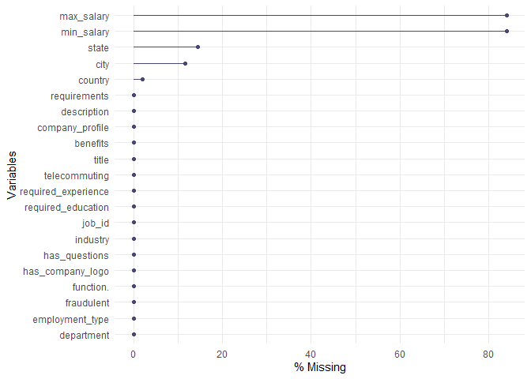
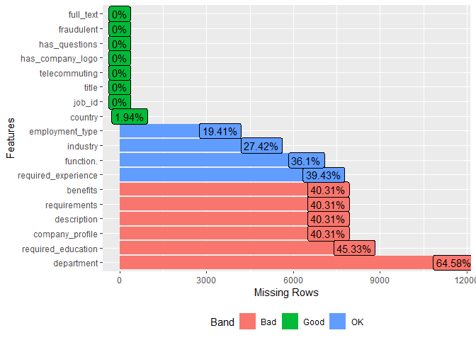
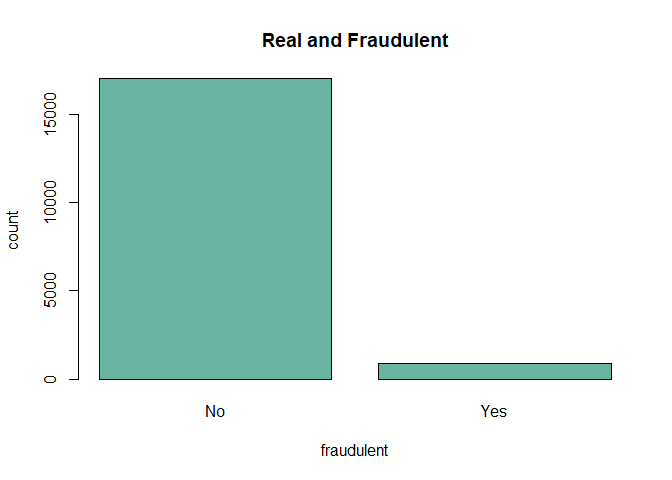
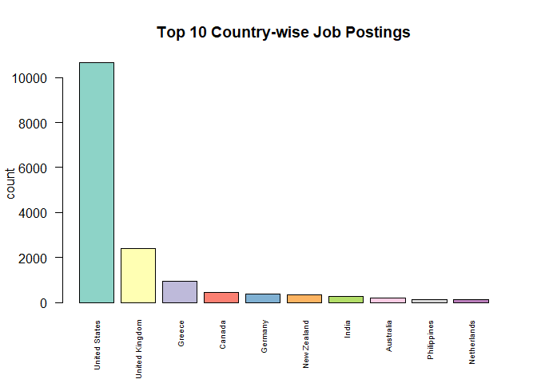
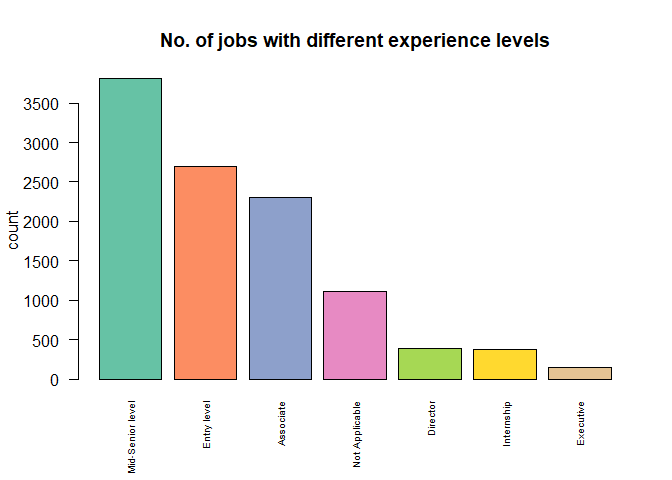
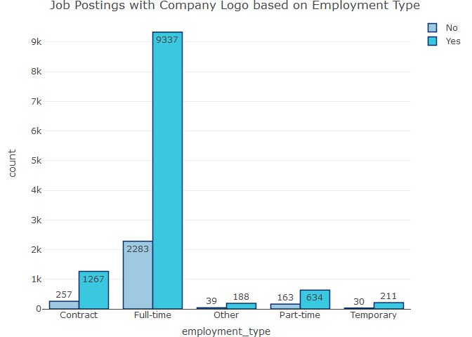
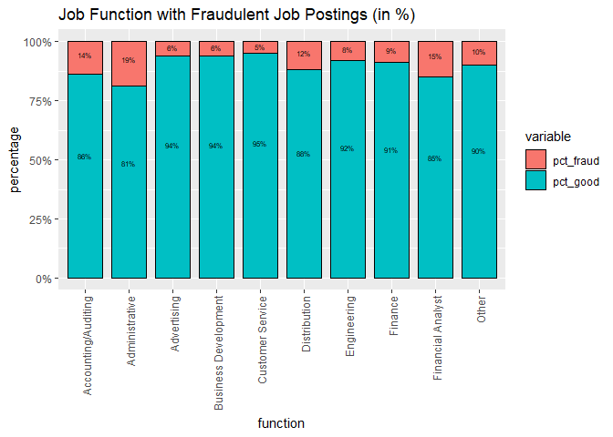

WQD7004 Group Assignment
================

# Fake Job Posting Analysis

### Group 4:

-   JingYu Shen (S2113037)
-   JiPing Zhang (S2042984)
-   Lee Mun Mun (S2112842)
-   Nayli Hatim (S2149344)
-   Jenifer Mayang Jues (S2016572)

# Introduction

# Initial Questions

-   What are the significant features of classifying fake job posting
-   Which classification model is the best to classify fake job posting

# Objectives

-   To identify key features of fraudulent job postings
-   To build a model to classify real or fake job postings

# Data Cleaning and Pre-processing

## Import libraries

## Load data

``` r
df <- read.csv("https://raw.githubusercontent.com/abbylmm/fake_job_posting/main/data/fake_job_postings.csv")
```

## Summary data

``` r
df_fake_job <- df
sample_n(df_fake_job, 3)
```

    ##   job_id                                 title            location
    ## 1   6335            Marketing Intern for Games GR, B, Thessaloniki
    ## 2  17291 Embedded Software / Firmware Engineer   US, MA, Cambridge
    ## 3  15906                      Branch Associate     US, MA, Medford
    ##       department salary_range
    ## 1      Marketing             
    ## 2                            
    ## 3 Medford Branch             
    ##                                                                                                                                                                                                                                                                                                                                                                                                                                                                                                                                                                                                                                                                                                                                                                                                                                                                                                                                                                                                                                                                                                                                                                                                                                                                                                                                                                                                                                                                                                                                                                                                                                                                                                                                                                                                                                                                                                                                         company_profile
    ## 1 At Total Eclipse we create fun, original, and addictive games that are easy to learn yet hard to master. We have a strong history of game releases, with 9 shipped games in 10 years, across different genres and #URL_d09fcd5154ef7c470dcdf6a9151af4f73dbcc5bda134912e2dedf1da67449c12# purpose is to â\200\230Popularise Playâ\200\231; we want to get more people to enjoy games as we believe that there is a potential gamer in each one of us.This is a truly exciting time for Total Eclipse! We are growing, and we intend to become one of the top brands in multiplatform casual gaming. Are you ready to be part of a small and agile team with a great vision? Then keep reading!Are we a good match?Every new addition to the team helps define Total Eclipseâ\200\231s future, so we want to make sure we would be a good match for each other.  We have many of the good qualities of a startup, such as low bureaucracy and a flat hierarchy, a flexible, open working space and a motivated, talented team which aims to make millions of peopleâ\200\231s lives more fun. We also have heaps of experience, having survived and thrived for years in a fiercely competitive environment. We embrace creativity, innovation, high quality, cooperation, teamwork and openness. We are not secretive; we enjoy exchanging knowledge not only among the team, but also with fellow game developers. Our industry changes rapidly and we must always stay on the cutting edge. We thirst for knowledge and have a passion for honing our skills and improving ourselves. We are team players, and are looking for more nice people who enjoy working as part of a tight team. We also value constructive feedback; it is a powerful tool to help make us and our games, better.  If you think in a similar way, you will feel right at home working with us. Take a look at our current openings and get in touch! Find out more about our company ethos!
    ## 2                                                                                                                                                                                                                                                                                                                                                                                                                                                                                                                                                                                                                                                                                                                                                                                                                                                                                                                                                                                                                                                                                                                                                                                                                                                                                                                                                                                                                                                                                                                                                                                                                                                                                                        Wallflowr is a Cambridge, MA based company working on developing technologies for a safer home and work environment. Wallflowr has a patent-pending system to detect the proximity of people and advanced control of appliances and devices. 
    ## 3                                                                                                                                                                                                                                                                                                                                                                                                                                                                                                                                                                                                                                                                                                                                                                                                                                                                                                                                                                                                                                                                                                                                                                                                                                                             Outstanding Member Service Starts With Outstanding PeopleIf you are committed to the concept of â\200œabove and beyondâ\200\235 and enjoy interacting with people either in person or on the telephone, then we want to talk to you.Our people are our most valuable asset. We recognize their value â\200“ the hard work and dedication they give â\200“ and reward it through a highly competitive salary structure and benefits program which includes:Medical, dental and vision insurance401k  Retirement Savings Plan with a match up to 6% by the Credit UnionFlexible Spending  AccountsLife insurance paid by the Credit UnionGenerous paid time offGym membership reimbursement program.
    ##                                                                                                                                                                                                                                                                                                                                                                                                                                                                                                                                                                                                                                                                                                                                                                                                                                                                                                                                                                                                                                                                                                                                                                                                                                                                                                                                                                                                                                                                                                                                                                                                                           description
    ## 1 You love stirring up a passion in people about new products. You excel at tailoring your marketing approach to different products and target groups. You flourish in online communities: not only are you adept at using all kinds of social media, you are also aware of netiquette and nuances of individual spaces and communities. You think positively, discover creative solutions, and you thrive when learning and improving yourself.We are looking to hire a talented Marketing Intern who is self-motivated and a strong team player. You will work closely with the rest of the team and help shape the digital marketing strategy for the Total Eclipse brand and games.We offer you a chance to join an agile team of experienced game developers, where terms like â\200œno bureaucracyâ\200\235 and â\200œflat hierarchyâ\200\235 actually mean something. We are big believers of respect, teamwork, assistance, and exchange of knowledge. If you share those beliefs, you will feel right at home working with us!Key responsibilitiesBe the liaison for any communications with our fans, the press, and PR agencies.Author any marketing copy required, from press releases to newsletters.Schedule topics for the Total Eclipse blog and manage the website news and updates.Increase the Total Eclipse brand and games awareness through the use of Social Media/PR/ads.Perform research for new ways to further increase awareness.Assist the development team by identifying target audience needs.Assist in the design and deliverance of launch campaigns, from pre-launch events to post-release targeting and follow-up.
    ## 2                                                                                                                                                                                                                                                                                                                                                                                                                                                                                                                                                                                                                                                                                                                                                                                                                                                                                                                                                                                  We are a self-funded startup based in Cambridge, MA developing smart, connected consumer electronics. Founderâ\200\231s include a serial entrepreneur whoâ\200\231s last exit was to #URL_b3c2faf1561263f094e891c6509e62a257da0056bca7a18d42c062d64c8a1ebc# and a corporate leader with a track record of bringing new products to market.We are looking for an Embedded Software / Firmware Engineer. The initial position will be part-time with the expectation that the candidate will accept a full-time role within the organization after a short trial period.ObjectiveDesign and develop firmware.Work with embedded hardware and software engineers.
    ## 3                                                                                                                                                                                                                                                                                                                                                                                                                                                                                                                                                                                                                                                                                                                                                                                                                                                                                                                                                                                             Would you like to work for a trusted organization that values its employees?  A USAlliance career is a journey that starts with a positive, productive, and engaging workplace where employees are valued and respected.We are looking for  Branch Service Associates to deliver excellent service and maximize Member solutions by identifying referral opportunities for new products and services based on Memberâ\200\231s financial goals while performing efficient and accurate banking transactions.Perform member transactions including deposits, withdrawals, money orders, etc.Cross sell USAlliance products and services.
    ##                                                                                                                                                                                                                                                                                                                                                                                                                                                                                                                                                                                                                                                                                                                                                                                                requirements
    ## 1                                                                                                                                                                                                                                                                                                Mastery of the English language, both written and oral.Experience with managing and growing online audiences through Facebook / Twitter / YouTube / Pinterest, etc.An active gamer, of any kind, from board games to consoles.Nice to HaveAt least one year of experience in digital marketing.Successfully promoted at least one game in the mobile market, desktop games a plus.Knowledge of the games market, the app market and the existing revenue models.Knowledge of ASO (App Store Optimisation).
    ## 2 - 2+ years of relevant work experience in embedded systems design and development.- Working knowledge in electronic design, computer architecture, and semiconductor technology.- Understanding of PCB design and fabrication.- Knowledge in both 32 and 64 bit architecture for multi-core processors.- Experience with Broadcom, MIPS, and ARM processors.- Experience in ASICs/FPGAs.- Significant experience troubleshooting.- Self-starter, ability to work and thrive with a small team.- Be located in the greater Boston area.- Be able to work in the United States.- Have a valid passport with the ability to travel internationally.- Bachelorâ\200\231s degree.- Previous experience bringing a product to market is a plus.- Previous experience working with outsourced manufacturing is a plus.
    ## 3                                                                                                                                                                                                                                                        Minimum of 1 year teller/cashier/cash handling experienceExcellent member service and communication skillsAbility to cross-sell products and services is keyRetail/Sales experience preferredMust have own transportation to travel to other area branches as neededWeekly schedule includes 9am â\200“ 2pm on SaturdaysAll positions must adhere to standard BSA/AML policies, procedures and processes.  Employees must demonstrate awareness of business functions and how business decisions affect financial and/or non-financial work results.
    ##                                                                                                                                                                                                                                                                                                                                                                                                                                                                                                                                                                                                             benefits
    ## 1 The chance to be part of a fun and friendly team with a solid history of game creation.The ability to meaningfully contribute in exciting new projects reaching millions of people worldwide.A great working space in Greece's second largest city. Lots of sun, sea, and great food!A competitive salary.Stock options &amp; performance-based bonus.Opportunities for advancement and learning.An extensive office library with technical books to borrow. We can also buy new books, which you suggest, that will assist your professional development.Perks that will add to your Steam/GoG games library! â\230º
    ## 2                                                                                                                                              What's In It for You- Get into a startup early with an experienced serial entrepreneur with a previous successful exit to a Fortune 100 tech company.- Become a core member of the team with the potential to assume a leadership role.- The development of innovative new products.- Work in the heart of the Kendall/MIT startup community.- Compensation package includes company stock- If youâ\200\231re looking for high risk, high reward, this is your opportunity.
    ## 3                                                                                                                                                     Our people are our most valuable asset. We recognize their value â\200“ the hard work and dedication they give â\200“ and reward it through a highly competitive salary structure and benefits program which includes:Medical, dental and vision insurance401k  Retirement Savings Plan with a match up to 6% by the Credit UnionFlexible Spending  AccountsLife insurance paid by the Credit UnionGenerous paid time offGym membership reimbursement program.
    ##   telecommuting has_company_logo has_questions employment_type
    ## 1             0                1             1       Full-time
    ## 2             0                1             1       Full-time
    ## 3             0                1             1       Full-time
    ##   required_experience        required_education             industry
    ## 1          Internship                                 Computer Games
    ## 2      Not Applicable         Bachelor's Degree Consumer Electronics
    ## 3           Associate High School or equivalent              Banking
    ##          function. fraudulent
    ## 1        Marketing          0
    ## 2      Engineering          0
    ## 3 Customer Service          0

``` r
summary(df_fake_job)
```

    ##      job_id         title             location          department       
    ##  Min.   :    1   Length:17880       Length:17880       Length:17880      
    ##  1st Qu.: 4471   Class :character   Class :character   Class :character  
    ##  Median : 8940   Mode  :character   Mode  :character   Mode  :character  
    ##  Mean   : 8940                                                           
    ##  3rd Qu.:13410                                                           
    ##  Max.   :17880                                                           
    ##  salary_range       company_profile    description        requirements      
    ##  Length:17880       Length:17880       Length:17880       Length:17880      
    ##  Class :character   Class :character   Class :character   Class :character  
    ##  Mode  :character   Mode  :character   Mode  :character   Mode  :character  
    ##                                                                             
    ##                                                                             
    ##                                                                             
    ##    benefits         telecommuting    has_company_logo has_questions   
    ##  Length:17880       Min.   :0.0000   Min.   :0.0000   Min.   :0.0000  
    ##  Class :character   1st Qu.:0.0000   1st Qu.:1.0000   1st Qu.:0.0000  
    ##  Mode  :character   Median :0.0000   Median :1.0000   Median :0.0000  
    ##                     Mean   :0.0429   Mean   :0.7953   Mean   :0.4917  
    ##                     3rd Qu.:0.0000   3rd Qu.:1.0000   3rd Qu.:1.0000  
    ##                     Max.   :1.0000   Max.   :1.0000   Max.   :1.0000  
    ##  employment_type    required_experience required_education   industry        
    ##  Length:17880       Length:17880        Length:17880       Length:17880      
    ##  Class :character   Class :character    Class :character   Class :character  
    ##  Mode  :character   Mode  :character    Mode  :character   Mode  :character  
    ##                                                                              
    ##                                                                              
    ##                                                                              
    ##   function.           fraudulent     
    ##  Length:17880       Min.   :0.00000  
    ##  Class :character   1st Qu.:0.00000  
    ##  Mode  :character   Median :0.00000  
    ##                     Mean   :0.04843  
    ##                     3rd Qu.:0.00000  
    ##                     Max.   :1.00000

## Check all the missing values - ‘empty’

``` r
skim(df_fake_job)
```

|                                                  |             |
|:-------------------------------------------------|:------------|
| Name                                             | df_fake_job |
| Number of rows                                   | 17880       |
| Number of columns                                | 18          |
| \_\_\_\_\_\_\_\_\_\_\_\_\_\_\_\_\_\_\_\_\_\_\_   |             |
| Column type frequency:                           |             |
| character                                        | 13          |
| numeric                                          | 5           |
| \_\_\_\_\_\_\_\_\_\_\_\_\_\_\_\_\_\_\_\_\_\_\_\_ |             |
| Group variables                                  | None        |

Data summary

**Variable type: character**

| skim_variable       | n_missing | complete_rate | min |   max | empty | n_unique | whitespace |
|:--------------------|----------:|--------------:|----:|------:|------:|---------:|-----------:|
| title               |         0 |             1 |   3 |   142 |     0 |    11231 |          0 |
| location            |         0 |             1 |   0 |   161 |   346 |     3106 |          0 |
| department          |         0 |             1 |   0 |   255 | 11547 |     1338 |          6 |
| salary_range        |         0 |             1 |   0 |    20 | 15012 |      875 |          0 |
| company_profile     |         0 |             1 |   0 |  6230 |  3308 |     1710 |          0 |
| description         |         0 |             1 |   3 | 22722 |     0 |    14802 |          0 |
| requirements        |         0 |             1 |   0 | 10921 |  2694 |    11970 |          0 |
| benefits            |         2 |             1 |   0 |  4489 |  7206 |     6207 |          0 |
| employment_type     |         0 |             1 |   0 |     9 |  3471 |        6 |          0 |
| required_experience |         0 |             1 |   0 |    16 |  7050 |        8 |          0 |
| required_education  |         0 |             1 |   0 |    33 |  8105 |       14 |          0 |
| industry            |         0 |             1 |   0 |    36 |  4903 |      132 |          0 |
| function.           |         0 |             1 |   0 |    22 |  6455 |       38 |          0 |

**Variable type: numeric**

| skim_variable    | n_missing | complete_rate |    mean |      sd |  p0 |     p25 |    p50 |      p75 |  p100 | hist  |
|:-----------------|----------:|--------------:|--------:|--------:|----:|--------:|-------:|---------:|------:|:------|
| job_id           |         0 |             1 | 8940.50 | 5161.66 |   1 | 4470.75 | 8940.5 | 13410.25 | 17880 | ▇▇▇▇▇ |
| telecommuting    |         0 |             1 |    0.04 |    0.20 |   0 |    0.00 |    0.0 |     0.00 |     1 | ▇▁▁▁▁ |
| has_company_logo |         0 |             1 |    0.80 |    0.40 |   0 |    1.00 |    1.0 |     1.00 |     1 | ▂▁▁▁▇ |
| has_questions    |         0 |             1 |    0.49 |    0.50 |   0 |    0.00 |    0.0 |     1.00 |     1 | ▇▁▁▁▇ |
| fraudulent       |         0 |             1 |    0.05 |    0.21 |   0 |    0.00 |    0.0 |     0.00 |     1 | ▇▁▁▁▁ |

## Split location to country, state, city and fill empty with NA

``` r
df_fake_job[c("country", "state", "city")] <- str_split_fixed(df_fake_job$location, ", ", 3)
df_fake_job[c("country", "state", "city")][df_fake_job[c("country", "state", "city")] == ""] <- NA
```

## Split salary_range to min_salary, max_salary and fill empty with NA

``` r
df_fake_job[c("min_salary", "max_salary")] <- str_split_fixed(df_fake_job$salary_range, "-", 2)
df_fake_job[c("min_salary", "max_salary")][df_fake_job[c("min_salary", "max_salary")] == ""] <- NA
```

## Drop location and salary_range

``` r
df_fake_job <- select(df_fake_job, -c(location, salary_range))
```

## Convert to lowercase string

``` r
cols <- c("company_profile", "description", "requirements", "benefits")
for (x in df_fake_job[cols]) {
  df_fake_job[cols] <- tolower(x)
}
```

## View the structure of data

``` r
glimpse(df_fake_job)
```

    ## Rows: 17,880
    ## Columns: 21
    ## $ job_id              <int> 1, 2, 3, 4, 5, 6, 7, 8, 9, 10, 11, 12, 13, 14, 15,~
    ## $ title               <chr> "Marketing Intern", "Customer Service - Cloud Vide~
    ## $ department          <chr> "Marketing", "Success", "", "Sales", "", "", "ANDR~
    ## $ company_profile     <chr> "", "what you will get from usthrough being part o~
    ## $ description         <chr> "", "what you will get from usthrough being part o~
    ## $ requirements        <chr> "", "what you will get from usthrough being part o~
    ## $ benefits            <chr> "", "what you will get from usthrough being part o~
    ## $ telecommuting       <int> 0, 0, 0, 0, 0, 0, 0, 0, 0, 0, 0, 0, 0, 0, 0, 0, 0,~
    ## $ has_company_logo    <int> 1, 1, 1, 1, 1, 0, 1, 1, 1, 1, 0, 1, 1, 1, 1, 1, 1,~
    ## $ has_questions       <int> 0, 0, 0, 0, 1, 0, 1, 1, 1, 0, 0, 0, 0, 1, 0, 1, 0,~
    ## $ employment_type     <chr> "Other", "Full-time", "", "Full-time", "Full-time"~
    ## $ required_experience <chr> "Internship", "Not Applicable", "", "Mid-Senior le~
    ## $ required_education  <chr> "", "", "", "Bachelor's Degree", "Bachelor's Degre~
    ## $ industry            <chr> "", "Marketing and Advertising", "", "Computer Sof~
    ## $ function.           <chr> "Marketing", "Customer Service", "", "Sales", "Hea~
    ## $ fraudulent          <int> 0, 0, 0, 0, 0, 0, 0, 0, 0, 0, 0, 0, 0, 0, 0, 0, 0,~
    ## $ country             <chr> "US", "NZ", "US", "US", "US", "US", "DE", "US", "U~
    ## $ state               <chr> "NY", NA, "IA", "DC", "FL", "MD", "BE", "CA", "FL"~
    ## $ city                <chr> "New York", "Auckland", "Wever", "Washington", "Fo~
    ## $ min_salary          <chr> NA, NA, NA, NA, NA, NA, "20000", NA, NA, NA, "1000~
    ## $ max_salary          <chr> NA, NA, NA, NA, NA, NA, "28000", NA, NA, NA, "1200~

``` r
class(df_fake_job)
```

    ## [1] "data.frame"

## View column names

``` r
names(df_fake_job)
```

    ##  [1] "job_id"              "title"               "department"         
    ##  [4] "company_profile"     "description"         "requirements"       
    ##  [7] "benefits"            "telecommuting"       "has_company_logo"   
    ## [10] "has_questions"       "employment_type"     "required_experience"
    ## [13] "required_education"  "industry"            "function."          
    ## [16] "fraudulent"          "country"             "state"              
    ## [19] "city"                "min_salary"          "max_salary"

## Check if any duplication id

``` r
table(duplicated(df_fake_job$job_id))
```

    ## 
    ## FALSE 
    ## 17880

``` r
### there is no duplication id
```

## Check for total missing values for each feature

``` r
colSums(is.na(df_fake_job))
```

    ##              job_id               title          department     company_profile 
    ##                   0                   0                   0                   2 
    ##         description        requirements            benefits       telecommuting 
    ##                   2                   2                   2                   0 
    ##    has_company_logo       has_questions     employment_type required_experience 
    ##                   0                   0                   0                   0 
    ##  required_education            industry           function.          fraudulent 
    ##                   0                   0                   0                   0 
    ##             country               state                city          min_salary 
    ##                 346                2580                2067               15012 
    ##          max_salary 
    ##               15013

``` r
### there are two missing values in 'benefits' column
```

## Populate missing rates for each feature

``` r
colSums(is.na(df_fake_job)/length(df_fake_job)*100)
```

    ##              job_id               title          department     company_profile 
    ##             0.00000             0.00000             0.00000             9.52381 
    ##         description        requirements            benefits       telecommuting 
    ##             9.52381             9.52381             9.52381             0.00000 
    ##    has_company_logo       has_questions     employment_type required_experience 
    ##             0.00000             0.00000             0.00000             0.00000 
    ##  required_education            industry           function.          fraudulent 
    ##             0.00000             0.00000             0.00000             0.00000 
    ##             country               state                city          min_salary 
    ##          1647.61905         12285.71429          9842.85714         71485.71429 
    ##          max_salary 
    ##         71490.47619

## List rows with missing values

``` r
missingdf <- df_fake_job[!complete.cases(df_fake_job), ]
```

## Visualize missing values

``` r
gg_miss_var(df_fake_job, show_pct = TRUE) + labs(y = "% Missing")
```

    ## Warning: It is deprecated to specify `guide = FALSE` to remove a guide. Please
    ## use `guide = "none"` instead.

<!-- -->

## Merge columns and create a new ‘full_text’ column

``` r
viz_df <- select(df_fake_job, -c(max_salary, min_salary, state, city))
viz_df[viz_df == ""] <- NA
viz_df$full_text <- 
  paste(na.omit(viz_df$title), 
        na.omit(viz_df$country), 
        na.omit(viz_df$department), 
        na.omit(viz_df$company_profile), 
        na.omit(viz_df$description), 
        na.omit(viz_df$requirements), 
        na.omit(viz_df$benefits), 
        na.omit(viz_df$employment_type), 
        na.omit(viz_df$required_experience), 
        na.omit(viz_df$required_education), 
        na.omit(viz_df$industry), 
        na.omit(viz_df$function.))
# sample(viz_df, 3)
# write.csv(viz_df, "C:/Users/munmu/Documents/GitHub/fake_job_posting\\viz_df.csv", row.names = FALSE)
```

## Visualize missing profile for each feature

``` r
plot_missing(viz_df)
```

<!-- -->

## Drop columns

``` r
model_df <- select(viz_df, 
                   -c(title, 
                      country, 
                      department, 
                      company_profile, 
                      description, 
                      requirements, 
                      benefits, 
                      employment_type, 
                      required_experience, 
                      required_education, 
                      industry, 
                      function.))
sample_n(model_df, 3)
```

    ##   job_id telecommuting has_company_logo has_questions fraudulent
    ## 1  15730             0                0             0          0
    ## 2   5193             0                1             1          0
    ## 3   5692             0                0             0          1
    ##                                                                                                                                                                                                                                                                                                                                                                                                                                                                                                                                                                                                                                                                                                                                                                                                                                                                                                                                                                                                                                                                                                       full_text
    ## 1 Manufacturing Engineering Manager US Sales/Rental benefits and compensation:negotiablehealth, dental, life &amp; vision insuranceflexible spending accountcompany funded health savingslong and short term disabilitypto (vacation and sick time)statutory holidays401k retirement planning benefits and compensation:negotiablehealth, dental, life &amp; vision insuranceflexible spending accountcompany funded health savingslong and short term disabilitypto (vacation and sick time)statutory holidays401k retirement planning benefits and compensation:negotiablehealth, dental, life &amp; vision insuranceflexible spending accountcompany funded health savingslong and short term disabilitypto (vacation and sick time)statutory holidays401k retirement planning benefits and compensation:negotiablehealth, dental, life &amp; vision insuranceflexible spending accountcompany funded health savingslong and short term disabilitypto (vacation and sick time)statutory holidays401k retirement planning Contract Not Applicable Bachelor's Degree Education Management Health Care Provider
    ## 2                                                                                                                                                                                                                                                                                                                                                                                                                                                                                                                                                                                                                                                                                                                                                                                                                                                                                                                   HGV Class 1 - Trunk Driver PE SA see job description see job description see job description see job description Full-time Entry level Bachelor's Degree Hospital & Health Care Engineering
    ## 3                                                                                                                                                                                                                                                                                                                                                                                                                                                                                                                                                                                                                                                                                                                                                                                                                                                                                                         Network Marketing US Marketing future prospects. future prospects. future prospects. future prospects. Full-time Mid-Senior level High School or equivalent Gambling & Casinos Information Technology

``` r
# write.csv(model_df, "C:/Users/munmu/Documents/GitHub/fake_job_posting\\model_df.csv", row.names = FALSE)
```

## Check NA or missing values

``` r
sum(is.na(model_df))
```

    ## [1] 0

``` r
sum(model_df == "")
```

    ## [1] 0

## Visualize missing values

``` r
vis_miss(model_df)
```

    ## Warning: `gather_()` was deprecated in tidyr 1.2.0.
    ## Please use `gather()` instead.
    ## This warning is displayed once every 8 hours.
    ## Call `lifecycle::last_lifecycle_warnings()` to see where this warning was generated.

<!-- -->

``` r
vis_dat(model_df)
```

<!-- -->

# Exploratory Data Analysis (EDA)

## Visualize fraud and real

``` r
viz_df$fraudulent[viz_df$fraudulent == 1] <- "Yes"
viz_df$fraudulent[viz_df$fraudulent == 0] <- "No"
count <- table(viz_df$fraudulent)
barplot(count, 
        main="Real and Fraudulent", 
        xlab="fraudulent", 
        ylab="count", 
        col="#69b3a2"
)
```

<!-- -->

## Visualize country-wise job postings

``` r
temp <- na.omit(subset(viz_df, select = c(country, job_id))) %>% 
  group_by(country) %>% 
  summarize(n = n()) %>% 
  arrange(desc(n)) %>% 
  slice(1:10)

barplot(height=temp$n, 
        main="Top 10 Country-wise Job Postings", 
        ylab="count", 
        col=brewer.pal(10, "Set3"), 
        names.arg=c("United States",
                    "United Kingdom",
                    "Greece",
                    "Canada",
                    "Germany",
                    "New Zealand",
                    "India",
                    "Australia",
                    "Philippines",
                    "Netherlands"), 
        cex.names=0.6, 
        las=2
)
```

<!-- -->

## Visualize the required experiences in the jobs

``` r
temp <- na.omit(subset(viz_df, select = c(required_experience, job_id))) %>% 
  group_by(required_experience) %>% 
  summarize(n = n()) %>% 
  arrange(desc(n))

barplot(height=temp$n, 
        names=temp$required_experience, 
        main="No. of Job Postings with different required experiences", 
        ylab="count", 
        col=brewer.pal(7, "Set2"), 
        cex.names=0.6, 
        las=2
)
```

<!-- -->

## Visualize job postings with company logo

``` r
viz_df$has_company_logo[viz_df$has_company_logo == 1] <- "Yes"
viz_df$has_company_logo[viz_df$has_company_logo == 0] <- "No"

df1 <- na.omit(subset(viz_df, select = c(employment_type, has_company_logo))) %>% 
  group_by(employment_type, has_company_logo) %>% 
  summarize(yes = n(), .groups = 'drop') %>% 
  filter(has_company_logo=="Yes")
df1 <- subset(df1, select = c(employment_type, yes))
df2 <- na.omit(subset(viz_df, select = c(employment_type, has_company_logo))) %>% 
  group_by(employment_type, has_company_logo) %>% 
  summarize(no = n(), .groups = 'drop') %>% 
  filter(has_company_logo=="No")
df2 <- subset(df2, select = c(no))
df_new <- cbind(df1, df2)

fig <- df_new %>% plot_ly()
fig <- fig %>% add_trace(x = ~employment_type, y = ~no, type = 'bar', 
             text = ~no, textposition = 'auto', name = 'No', 
             marker = list(color = 'rgb(158,202,225)', 
                           line = list(color = 'rgb(8,48,107)', width = 1.5)))
fig <- fig %>% add_trace(x = ~employment_type, y = ~yes, type = 'bar', 
            text = ~yes, textposition = 'auto', name = 'Yes', 
            marker = list(color = 'rgb(58,200,225)', 
                          line = list(color = 'rgb(8,48,107)', width = 1.5)))
fig <- fig %>% layout(title = "Job Postings with Company Logo based on Employment Type",
         barmode = 'group',
         xaxis = list(title = "employment_type"),
         yaxis = list(title = "count"))
fig
```

<!-- -->

## Visualize job postings with questions

``` r
viz_df$has_questions[viz_df$has_questions == 1] <- "Yes"
viz_df$has_questions[viz_df$has_questions == 0] <- "No"

df1 <- na.omit(subset(viz_df, select = c(employment_type, has_questions))) %>% 
  group_by(employment_type, has_questions) %>% 
  summarize(yes = n(), .groups = 'drop') %>% 
  filter(has_questions=="Yes")
df1 <- subset(df1, select = c(employment_type, yes))
df2 <- na.omit(subset(viz_df, select = c(employment_type, has_questions))) %>% 
  group_by(employment_type, has_questions) %>% 
  summarize(no = n(), .groups = 'drop') %>% 
  filter(has_questions=="No")
df2 <- subset(df2, select = c(no))
df_new <- cbind(df1, df2)

fig <- df_new %>% plot_ly()
fig <- fig %>% add_trace(x = ~employment_type, y = ~no, type = 'bar', 
             text = ~no, textposition = 'auto', name = 'No', 
             marker = list(color = 'rgb(158,202,225)', 
                           line = list(color = 'rgb(8,48,107)', width = 1.5)))
fig <- fig %>% add_trace(x = ~employment_type, y = ~yes, type = 'bar', 
            text = ~yes, textposition = 'auto', name = 'Yes', 
            marker = list(color = 'rgb(58,200,225)', 
                          line = list(color = 'rgb(8,48,107)', width = 1.5)))
fig <- fig %>% layout(title = "Job Postings with Questions based on Employment Type",
         barmode = 'group',
         xaxis = list(title = "employment_type"),
         yaxis = list(title = "count"))
fig
```

<!-- -->

## Visualize the job function with fraudulent job postings

``` r
temp <- na.omit(subset(viz_df, select = c(function., fraudulent))) %>% 
  group_by(function., fraudulent) %>% 
  summarize(n = n(), .groups = 'drop') %>% 
  group_by(function.) %>% 
  summarize(pct_fraud = round(sum(n[fraudulent=="Yes"]/sum(n)), digits=2), 
            pct_good = 1-pct_fraud, .groups = 'drop') %>% 
  arrange(desc(pct_fraud)) %>% 
  slice(1:10)

melted_temp <- melt(temp, id = "function.")

ggplot(melted_temp, aes(x = function., y = value, fill = variable)) + 
  geom_bar(position = "fill", 
           stat = "identity", 
           color = "black", 
           width = 0.8) + 
  theme(axis.text.x = element_text(angle = 90, hjust = 1, vjust = 0.6)) + 
  scale_y_continuous(labels = scales::percent) + 
  geom_text(aes(label = paste0(value*100,"%")), 
            position = position_stack(vjust = 0.6), size = 2) + 
  ggtitle("Job Function with Fraudulent Job Postings (in %)") + 
  xlab("function") + 
  ylab("percentage")
```

<!-- -->

# Modeling

## Classification

## Regression

# Data Prediction

# Evaluation
